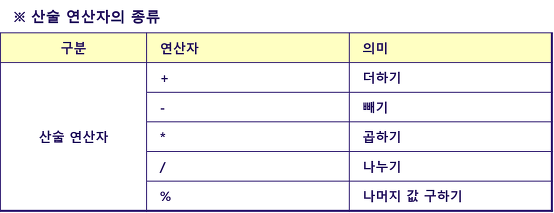
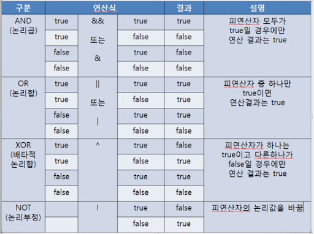
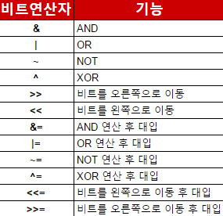
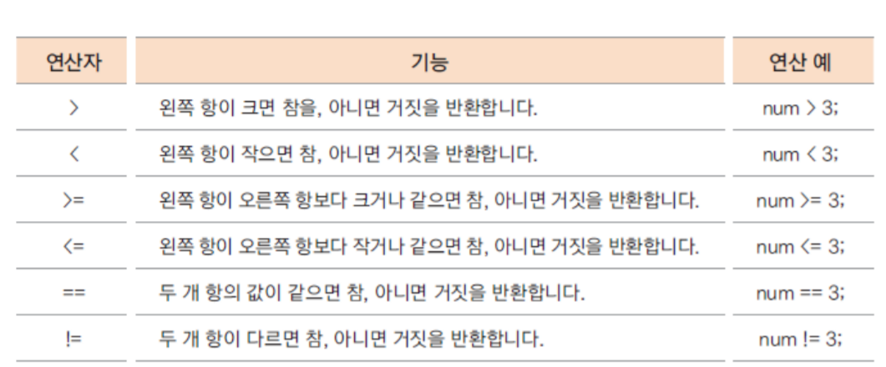
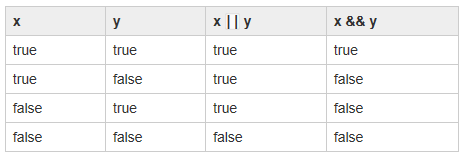

# week 03. 연산자

### 3-1. 산술연산자

산술 연산자란 자바에서 제공하는 기본적인 산수식을 떠올리면 된다. 다음 표를 참고하여 보자.


기본적인 사칙연산 외로 나머지 값 구하기가 포함되어 있다.
```
System.out.println(18 + 5); //23
System.out.println(18 - 5); //13
System.out.println(18 * 5); //90
System.out.println(18 / 5); //3
 
System.out.println(19 % 5); //4
```
위의 코드를 참조하여 % 연산자의 역할을 기억해두자.


### 3-1. 비트 연산자

일단 논리 연산자에 대해 알아보도록 하자. 다음 표를 참고한다.  
  
표를 보면 연산식을 기준으로 왼쪽 오른쪽의 비트를 통하여 결과 값을 표현해 놓았다. XOR의 경우에는 두 개가 같으면 false라고 기억해 두면 편하다.

이를 토대로 자바에서 비트 연산자를 알아보도록 해보자.



> &: 두 비트 모두 1일 경우에만 1  
  00001111 -> 15  
  00011001 -> 25  
  ============  
  00001001 -> 9
  

> |: 두 비트 중 하나라도 1일 때 1
  00001111 -> 15  
  00011001 -> 25  
  ============  
  00011111 -> 31

  
> ~: 보수 (최상위 비트는 부호 결정)
  00001111 -> 15  
  ============  
  11110000 -> -16  

  
> ^: 서로다른 경우 1
  00001111 -> 15  
  00011001 -> 25  
  ============  
  00010110 -> 22  


> \>>: 쉬프트연산 비트를 오른쪽으로 이동
  00001111 -> 15  
  \>> 1  
  ========  
  00000111 -> 7  
  
> \<<: 쉬프트연산 비트를 왼쪽으로 이동  
  00001111 -> 15  
  \<< 1  
  ========  
  00011110 -> 30  
  
> = 대입연산자가 들어 간 경우 계산 후 대입을 해준다고 생각하면 된다.

### 3-3. 관계 연산자


관계 연산자는 두 항의 관게에 대해서 계산하는 연산자이다. 쉽게 수학에서의 부등호를 생각하면 쉽다.

크다 작다 외로 = 연산자가 있으면 같다까지 포함이며 (3 >= 3 은 참이다 3과 3이 같은 값이기 때문에) ! 연산자가 들어갈 경우에는 not이 포함되어 있다고 생각하면 된다.
즉 != 는 같지 않으면의 표현이다.


### 3-4. 논리 연산자


논리 연산자란 논리 자료형(logical 로 표시하며 T/F를 의미)를 연산하여 TRUE / FALSE 를 계산하여 하나의 결과를 만드는 것이다.
사전적 의미보다는 직접 표를 보도록 하자.

x || y 는 x와 y의 논리 연산을 표하고 있다. 이 때 x와 y를 true 혹은 false로 생각 해보자.
true || false 의 값은 결국 true가 된다. 그럼 이런 식을 자바에서는 어떻게 사용할까?

바로 위의 관계 연산자를 함께 사용하면 쉽게 이해가 된다. 즉

(4 > 3) || (1 > 2) 식으로 본다면 4는 3보다 크기 때문이 true이고 1은 2보다 작기 때문에 false가 된다.
즉 ture || false와 같은 형태가 되므로 답은 true가 된다.


### 3-5. instanceof

참조변수가 참조하고 있는 인스턴스의 실제 타입을 알아보기 위해 instanceof 연산자를 사용하며 true와 false를 리턴한다.
instanceof는 우리가 저번 시간에 배웠던 String 타입이나 새로 생성한 객체의 타입을 확인할 때 주로 사용한다. 예시를 보도록 하자.

```
 String s = new String("123");
 System.out.println(s instanceof String); //true 출력
```

### 3-6. assignment(=) operator
대입 연산자라고 불리우는 = 는 오른쪽에 있는 항의 값을 왼쪽에 대입한다는 의미이다.  
보통 수학에서 사용되는 = 와 달리 자바의 = 연산자는 대입을 의미하며 수학의 = 는 자바에선 == 로 사용된다.

즉 같다는 의미는 == 로 사용된다.

다음 예제를 보도록 하자.

```
int a = 3;
System.out.println(a); //3출력
```

전 시간에 배웠던 리터럴 3의 값을 int형 프리미티브 타입 변수 a에 3을 대입 시켰다.
때문에 출력 결과는 3이다. 

= 이 대입 연산자로 쓰이는 예를 3-1 비트 연산자의 예제에서도 볼 수 있다.
&= 이 연산자의 의미는 & 연산을 하고 난 뒤 값을 = (대입) 하라는 의미이다.

추가적으로 자바에서 += 의 의미는 더한 뒤 오른쪽 항을 왼쪽에 대입 하라는 의미이다.

```
int a = 3;
a += 3;
System.out.println(a); //6
```
3 리터럴 값을 a에 대입 하였고 += 연산자를 통해 3의 연산을 하면 3+3 을 최종적으로 a에 대입하게 된다.  
마찬가지로 -=, *=, /=, %= 의 의미는 빼기 연산 뒤에 대입, 곱하기 연산 뒤에 대입, 나누기 몫의 값을 대입, 나누고 남은 나머지의 연산 뒤에 대입을 뜻한다.


### 3-7. 화살표(->) 연산자

3장의 내용이 보통 어떤 프로그래밍 언어에서도 사용 되는 기초적인 시직이기 때문에, 쉽게 접근이 가능 했겠지만 화살표 연산자는 기본적인 자바의 이해가 있어야 함을 기억하자.

일단 화살표 연산자는 자바의 람다식에 사용이 된다.
람다 표현식은 자바8부터 들어간 기능으로 기본적인 목적은 보기 쉬운 코에 주 목적이 있다.

다음 예제를 보도록 하자.

```
new Thread(new Runnable() {
    public void run() {
        System.out.println("running");
    }
}).start();
```

위의 예제는 전통적으로 사용 되었던 스레드 생성 후 run의 방식이다.  
이를 람다식으로 바꿔 보자.

```
new Thread(()->{
    System.out.println("runnning");
}).start();
```
코드가 간결해 진 것을 볼 수 있으며 바로 여기서 화살표 연산자를 찾을 수 있다.  

람다의 문법은 (매개변수)->{구현부} 로 생각하면 쉽다. 화살표 연산자는 이렇게 매개변수와 구현부를 구분해준다.

### 3-8. 3항 연산자

3항 연산자란 자바에서 조건문을 쉽게 하는 표현식이다. 표현식은 true와 flase일 때의 조건 식을 다루게 된다. 다음 예제를 보도록하자.
``` 
int a = 3;
a = a > 2 ? 9 : 10;
System.out.println(a); //9
```
3항 연산자의 구조를 먼저 확인해보자.

>조건 ? true 일때 : false 일때

식을 천천히 파헤쳐 보면, 일단 변수 a의 값은 3이다. 그리고 조건인 a > 2를 확인해보자. a는 2보다 크므로 참이다.  
? 뒤의 식을 보면 true : false에 따라 true일 때 9를 넣어주고 false일 때 10을 넣어준다.

따라서 a의 최종 값은 9가 되는 것이다.


### 3-9. 연산자 우선 순위


연산자 우선 순위는 자바에서 어떤 식이 주어 졌을 때 먼저 계산되는 식(항) 들을 정해 놓은 것이다.
주로 수학 연산과 비슷하다고 생각하면 된다.


### 3-10. switch 연산자

자바에서 switch는 자바 12, 그리고 13을 통해 많은 변화가 일어 났었다.

일단 기존 문법을 보도록 하자.

```
 int result = switch (mode) {
            case "a":
            case "b":
                break 1;
            case "c":
                break 2;
            case "d":
            case "e":
            case "f":
                break 3;
            default:
                break -1;
        };
```

타 언어와 마찬가지로 break가 있고 조건해 해당되는 case가 있다면 해당 조건의 코드를 실행 하고 break문을 만나 멈추거나 아래의 case로 빠지는 구조였다.

이를 자바12 버전의 switch로 바꾸어 보자.

```
int result = switch (mode) {
            case "a", "b" -> 1;
            case "c" -> 2;
            case "d", "e", "f" -> {
                // do something here...
                System.out.println("Supports multi line block!");
                yield 3;
            }
            default -> -1;
        };
```
아까 보았던 화살표 연산자가 사용 되었으며 식이 좀 더 간결해 진것을 볼 수 있다.

그리고 자바 13에선 yield 키워두가 추가 되었다.

```
 int result = switch (mode) {
            case "a", "b":
                yield 1;
            case "c":
                yield 2;
            case "d", "e", "f":
                // do something here...
                System.out.println("Supports multi line block!");
                yield 3;
            default:
                yield -1;
        };
```
자바13에서도 마찬가지로 화살표 연산자는 사용 가능하다. yield 키워드는 switch 식의 결과의 값이라고 생각하면 된다.
예를들어 위의 코드에서 mode가 "a"일 경우 yield 1을 실행하면 최종적으로 result의 값은 1이 되는 것이다.
