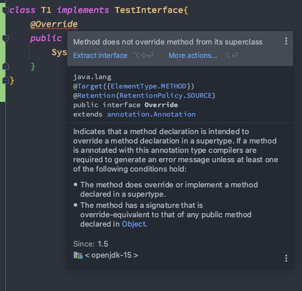

# week 08. 인터페이스

### 8-1. 인터페이스 정의하는 방법

인터페이스는 class 키워 대신 interface 키워드를 사용하여 정의한다.

```
interface a {
}
```

클래스에서는 생성자가 있거나, 변수 메소드 등을 가지고 있지만 인터페이스에서는 상수와 메소드만을 가지게 된다.

- 인터페이스는 추상 메서드와 상수만 멤버로 가질 수 있다.
- 일반 메서드와 멤버 변수는 구성원으로 가질 수 없다.
- 모든 멤버 변수는 public static final이어야 하며, 이를 생략할 수 있다.
- 모든 메서드는 public abstract이어야 하며, 이를 생략할 수 있다.
- 자바8 부터는 인터페이스에 default 메소드를 사용 가능하다.

```
interface a {
    int a = 1; //자동으로 public static final 키워드가 붙게 된다.
    void print(); // 자동으로 pulbic abstract 키워드가 붙게 된다. 
    //{} 메소드의 구현부가 있으면 컴파일 에러이다.
}
```

### 8-2. 인터페이스 구현하는 방법

인터페이스는 extends 키워드가 아닌 implements 키워드를 이용하게 된다.  
인터페이스로 선언 되어 있는 메소드들은 전부 클래스에서 구현을 해줘야 한다.

아래 예제를 보도록 하자.

```
public interface TestInterface {
    int a = 1 ;
    void print();
}
```

```

public class Main {
    public static void main(String[] args) {
    }

}

class T1 implements TestInterface{

    @Override
    public void print() {
        System.out.println("구현해줘야한다");
    }
}

```

아래 T1 클래스는 TestInterface를 구현하게 되어 @Override 애노테이션이 있는 메서드를 구현해주게 된다. (구현하지 않으면 컴파일 에러)

이처럼 인터페이스에 명시 된 메소드들은 반드시 구현을 해 줘야 하며 강제로 구현해야 하는 메소드가 정의되어 구현의 강제, 즉 규격화가 이뤄지게 된다.
또한 각 클래스 마다 구현부를 다르게 구현 할 수 있으니 다형성의 장점까지 얻게 된다.

### 8-3. 인터페이스 레퍼런스를 통해 구현체를 사용하는 방법

Main 클래스에서 인터페이스 참조변수를 생성하고 구현체를 구현해보도록 하자.

```
public class Main {
    public static void main(String[] args) {
        TestInterface t = new TestInterface() {
            @Override
            public void print() {
                
            }
        };
    }
}
```

위와 같이 구현이 된다면 어떤 이점이 있을까? 바로 일회성이다.

만약 인터페이스를 일회성으로 사용 할 경우 위와 같은 방법으로 익명 구현 객체를 통하여 구현하도록 하자.


### 8-4. 인터페이스 상속

자바에서 클래스는 다중 상속이 불가능하다. 하지만 인터페이스는 다중 상속이 가능하다.

```
public interface TestInterface {
    int a = 1 ;
    void print();
}

interface TestInterface2 {
    void print();
}

interface TestInterface3 extends TestInterface, TestInterface2 {
    void print();
}
```

### 8-5. 인터페이스의 기본 메소드 (Default Method), 자바 8

인터페이스가 내에 default 키워드가 붙은 메소드들은 인터페이스 내에서 구현이 가능하다.
또한 이 인터페이스를 구현하는 클래스에서는 이를 오버라이딩(재정의) 할 수 있다.

```
public interface TestInterface {
    int a = 1 ;
    default void print() {
        System.out.println("구현!");
    }
}
```
```
class T1 implements TestInterface{
    @Override
    public void print() {
        System.out.println("구현2");
    }
}
```

위의 예제에서 default로 선언 된 print() 메소드가 구현되어 있는 것을 볼 수 있다.

interface를 상속 받은 뒤로 default 메소드의 수정이 필요 할 때 상속받고 있던 인터페이스에서 굳이 상속을 한 인터페이스의 메소드를 수정 할 것 없이 바로 상속받아 오버라이딩이 가능하다.


### 8-6. 인터페이스의 static 메소드, 자바 8

static 메소드는 오버라이드 하여 재정의가 불가능하다.
예제를 다음과 같이 바꿔 보도록 하자.

```
public interface TestInterface {
    int a = 1 ;
    static void print() {
        System.out.println("구현!");
    }
}
```



이후 오버라이딩 하려고 하면 이처럼 컴파일 에러가 발생한다.

또한 이 메소드는 반드시 클래스 명으로 호출 해야 한다.
다음 예제를 확인해보자.

```
public class Main {
    public static void main(String[] args) {
        TestInterface.print(); // 구현!
    }
}
```

위에 정의된 인터페이스에 나와 있듯이 구현! 이 출력 되게 된다.
디폴트 메소드와는 달리 참조변수의 구현 없이도 호출이 가능하다.


### 8-7. 인터페이스의 private 메소드, 자바 9

private 메서드는 자바 인터페이스 안에서만 사용 되는 메소드이다.
이는 구현 클래스와 인터페이스의 상속 또한 불가능 하다.

private 메서드는 private, abstract, default, static 메서드를 호출 할 수 있다.
private static은 static, private static을 호출 할 수 있다.  
(static 메소드에서도 private static이 호출 가능)


```
public interface TestInterface {
    int a = 1 ;
    default void print() {
        privatePrint();
        staticPrint();
        privateStaticPrint(); //호출 가능 범위 확
    }

    private void privatePrint() {
        System.out.println("내부구현!");
    }

    static void staticPrint() {
        privateStaticPrint();
    }
    
    private static void privateStaticPrint() {
        System.out.println("private 구현");
    }
}
```

### 8-8. abstract class와 다른 점

interface에 default 메서드가 생기면서 abstract 클래스와 역할이 중복이 된 다고 생각 할 수 있자만,
abstract class는 역할의 확장에 주 목적이 있다. 즉 abstract class를 상속받는 클래스 입장에서 메서드를 override 하여 기능을 확장 한다.

반면 interface는 메서드를 강제로 구현 시키는데 목적이 있다.

또한 interface에서는 상수만 사용 가능한 반면 abstract class의 경우에는 접근 제어자를 사용하여 필드의 접근성을 조절 할 수 있다.
