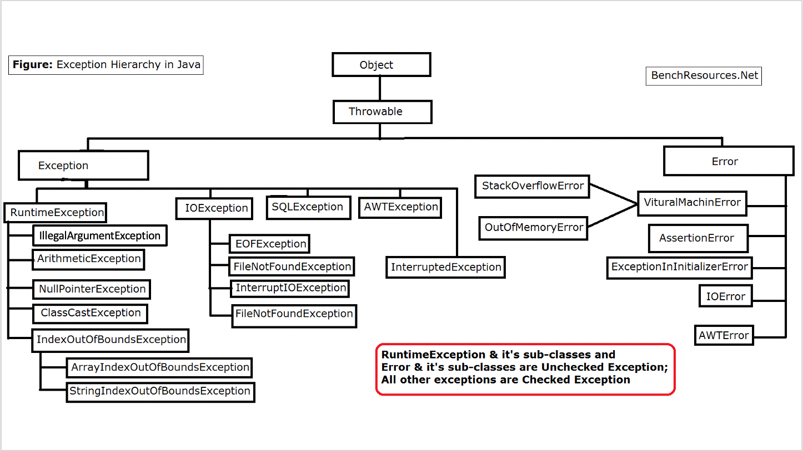
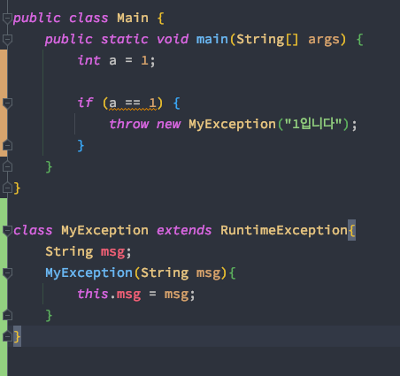

# week 09. 예외 처리

### 9-1. 자바에서 예외 처리 방법 (try, catch, throw, throws, finally)

자바에서 예외처리란 무엇일까?

예외란 컴파일 타임에는 문제가 없지만 프로그램이 실행 중 발생하는 오류를 뜻하고, 예외처리란 이 오류를 처리하는 과정을 뜻한다.

만약 예외처리가 일어나지 않는다면 어떻게 될까?

프로그램은 종료 될 것이고, 서비스가 불가능 할 것이다.

일반적으로 우리가 생각하는 모든 서비스들은 24시간 서비스가 가능하다. 즉 언제라도 서비스가 이용 가능해야 하며 서비스가 이용 불가능시 서비스 점검을 거는 등의 행위로 서비스를 일시적으로 중단하게 된다.

이 때문에 우리는 예외처리를 두어 프로그램이 종료되지 않고 서비스가 계속해서 서비스 가능 하도록 해 주는 것이다.

다음은 예외를 처리하는 방법을 살펴보도록 하자.

```
try{

    예외 발생 가능성이 있는 코드;
    
}catch(예외타입1 변수명){

    예외타입1의 예외가 발생할 경우 처리 문장들;

}catch(예외 타입 n 매개변수명){

    예외타입 n의 예외가 발생할 경우 처리 문장들;

}finally{

    항상 수행할 필요가 있는 문장들;

}

```

try 블록은 예외가 발생할 가능성이 있는 범위를 지정하는 블록이다. try 블록은 최소한 하나의 catch 블록이 있어야 하며, catch 블록은 try 블록 다음에 위치한다.

catch 블록의 매개변수는 예외 객체가 발생했을 때 참조하는 변수명으로 반드시 java.lang.Throwable 클래스의 하위 클래스 타입으로 선언되어야 한다.

지정된 타입의 예외 객체가 발생하면 try 블록의 나머지 문장들은 수행되지 않고, 자바 가상 머신은 발생한 예외 객체를 발생시키며 발생한 예외 객체 타입이 동일한 catch 블록을 수행한다.

finally 블록은 필수 블록은 아니다.  
finally 블록이 사용되면 finally 블록의 내용은 예외 발생 유무나 예외 catch 유무와 상관 없이 무조건 수행된다. 따라서, 데이터베이스나 파일을 사용한 후 닫는 기능과 같이 항상 수행해야 할 필요가 있는 경우에 사용한다.

또한 자바 7버전 부터 등장한 Try-with-resources 가 있는데, 자원을 생성하고 코드가 끝나면 자원을 해제해 주는 역할을 한다.
아래 예제를 보도록 하자.

```
try(FileOutputStream out = new FileOutputStream("testFile.txt")) {
            //정상적으로 로직이 실행되고 나면 out은 close 되게 된다.
} catch(IOException e) { 
            // 에러를 만났을 때 실행 될 구문
            // 없어도 된다
            e.printStackTrace(); 
} finally {
            // 마찬가지로 무조건 실행되는 구문
            // 없어도 된다 
}
```

try () 안에 resource가 들어가게 되고 이 자원은 try 문이 끝나면 자동으로 소멸하게 된다.

그렇다면 저 구문을 모든 객체 생성에서 가능할까?

저 자원은 내부적으로 close() 라는 인터페이스로(Autocloseable) 선언 된 메소드를 실행시키게 되는데 이 close가 구현되어 있는 경우에만 사용이 가능하다.

만약 close()를 하다가 예외를 만나게 된다면 catch 문으로 빠져 catch에 정의 된 코드들이 실행되게 된다.


throw와 throws에는 차이가 있는데, 일단 

throw는 예외를 발생시킬 때 사용되는 키워드이다. 만약 어떠한 처리를 하다가 예외를 발생 시키고 싶은 경우에 사용되는 키워드이다.

```
int a = 1;
        
if (a == 1) {
    throw new ArithmeticException();
}
```

예시가 a가 1일 경우 발생되는 에러이지만, 비즈니스 로직에서 조건을 검사하여 exception을 던지는 경우가 있다면 이해하기 쉽다.  
(가령 유저의 금액이 구매하려는 금액보다 적어 구입이 불가능 한 경우)


throws는 메소드에 사용 되는 키워드 인데, Exeption을 명시적으로 정의하게 된다.
따라서 어떤 예외가 발생 할 수 있는지 볼 수 있게 된다.

```
 private static void check() throws FileNotFoundException {
        FileOutputStream out = new FileOutputStream("testFile.txt"));
    }
```

위의 예시에서 보듯이 FileOutputStream 이라는 클래스의 객체를 생성하기 위해서 FileNotFoundException을 명시해줬다.  
해당 구문은 try catch로 아예 감싸버리기도 가능하다.

```
private static void check() {
    try {
        FileOutputStream out = new FileOutputStream("testFile.txt");
    } catch (FileNotFoundException e) {
        e.printStackTrace();
    }
}
```


### 9-2. 자바가 제공하는 예외 계층 구조


자바에서는 큰 분류로 Error와 Exception 클래스로 분류가 된다.



Exception의 경우 클래스로 계층화 되어 있는 것을 확인 할 수 있는데, RuntimeException의 경우 개발자가 실수로 만나는 예외들이 있다.

이런 예외들은 프로그램 개발 시 기본적으로 만나는 것을이 많으며 이런 예외들을 프로그램 런타임에 예외처리를 해주기 보다 예외를 만나지 않도록 코드를 수정하는 것이 더 옳은 방법이라고 생각한다.


### 9-3. Exception과 Error의 차이는?

Error의 경우에는 시스템적인 영향으로 인한 경우가 많다. 이 부분은 개발자가 다루기 보다 시스템에서 처리를 해줘야 하는 경우가 있다.  
(JVM에서 발생 시킴, 주로 프로그램에서 개발자에 의해 발생 되는 경우가 드물다)

Exception의 경우는 개발자가 만나는 예외들이라고 생각하면 쉽다.

즉 기본적으로 만나는 예외들을 만나지 않게 하거나, 개발자가 throw 키워드를 통해 일부러 예외를 발생시켰다면 그에 관한 처리가 이루어져야 한다.

Exception은 크게 checked와 unchecked로 나뉘게 되는데, checked는 컴파일 타임에 발생 되는 예외이며 uncheced는 런타임에 발생되는 예외이다.


### 9-4. RuntimeException과 RE가 아닌 것의 차이는?

앞서 설명한것과 마찬가지로 런타임에 발생되는 예외는 RuntimeException이다.

일단 종류를 조금 살펴보도록 하자.

>NullPointerException: null 객체를 참조 할 때 발생  
ArrayIndexOutOfBoundsException: 배열의 인덱스 범위를 벗어 날 때 발생  
NumberFormatException: 문자열을 숫자로 바꿀 때 숫자로 바꿀 수 없는 문자가 포함되어 있을 때 발생  
.
.
.

위와 같은 예외들은 실제 프로그램이 구동중일 때 만날 수 있는 예외들이며 이 예외들은 컴파일 타임에 체크가 불가능하다.

따라서 이런 예외들을 만났을 때 예외 처리를 해줘야 한다.

다음은 RE가 아닌 것을 확인해보자.

일단 둘의 차이는 checked의 경우 예외를 예측 할 수 있기 때문에 exception을 처리하는 handler가 강제 된다.
즉 예외가 발생 할 수 있기 때문에 미리 처리를 해놓는 것이다.

이런 예외를 처리하기 위해 우리는 try catch 구문을 사용하게 되는 것이다.

또한 RE가 아닌 경우는 java.lang.Exception 상속 받으며 RE인 경우 Unchecked Exception을 상속받아 사용자 정의 예외처리를 만들 수 있다.

그렇다면 사용자 예외처리는 무엇일까?

### 9-5. 커스텀한 예외 만드는 방법

기존의 정의된 예외 클래스 외에 필요에 따라 개발자가 새로운 예외 클래스를 정의하여 사용할 수 있다.

```
public class Main {
    public static void main(String[] args) {
        int a = 1;

        if (a == 1) {
            try {
                throw new MyException("1입니다");
            } catch (MyException e) {
                System.out.println(e.msg);
            }
        }
    }
}

class MyException extends Exception{
    String msg;
    MyException(String msg){
        this.msg = msg;
    }
}
```

출력 결과는 1입니다 가 된다.

보이는 바와 같이 Exception 클래스를 상속 받아 만들었기 때문에 checked Exception, 즉 
RE이 아닌 예외이기 때문에 위와 같이 try catch 구문으로 감싸게 되었다.

그렇다면 RuntimeException을 상속 받게 되면 try catch 문은 필요 없을까?



위와 같이 컴파일 타임에는 문제가 없다.

하지만 직접 구문을 실행하게 되면 프로그램이 종료되어 버린다. 왜냐하면 던진 MyException을 핸들링 하지 않기 때문이다.

때문에 우리가 원하는 예외처리의 결과가 아니므로 try catch 구문으로 다시 테스트를 해보자.


```
public class Main {
    public static void main(String[] args) {
        int a = 1;

        if (a == 1) {
            try {
                throw new MyException("1입니다");
            } catch (MyException e) {
                System.out.println(e.msg);
            }
        }
    }
}

class MyException extends RuntimeException{
    String msg;
    MyException(String msg){
        this.msg = msg;
    }
}
```

결과는 위와 마찬가지로 1입니다 가 출력되게 된다.