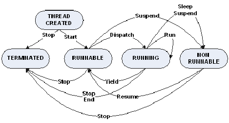
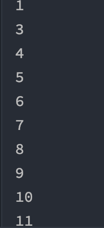
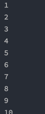

# week 10. 멀티쓰레드 프로그래밍 

### 10-1. Thread 클래스와 Runnable 인터페이스

일단 쓰레드란 무엇일까?

쓰레드란 프로세스에서 생성 된 일의 단위로써 하나의 프로세스는 최소 하나의 쓰레드를 가지고 있다.

따라서 하나 이상의 쓰레드를 생성하면 일의 단위가 늘어나기 때문에 병렬 처리가 가능해 지는 것이다. 이것이 `멀티 쓰레드` 인 것이다.


자바에서 멀티쓰레드를 위한 생성 방식은 2가지가 있다.

이것이 바로 Thread 클래스와 Runnable 인터페이스이다.

그렇다면 두 가지의 차이점은 무엇일까?

java에서는 다중 상속이 불가능하다. 때문에 Thread 클래스를 상속 받게 되면 다른 클래스는 상속을 받지 못한다. 때문에 보통은 Runnable 인터페이스를 구현하여 멀티 쓰레드를 구현하는 것이 보통이다.

다음은 Thread 클래스를 상속받아 아주 간단하게 구현된 클래스이다.

```
public class Main {
    public static void main(String[] args) {
        Test t = new Test();
        t.start();
    }
}

class Test extends Thread {
    int a = 0;

    public void run() {
        a++;
        System.out.println(a);
    }
}
```

다음은 Runnable 인터페이스를 사용해 보도록 하자.
```
public class Main {
    public static void main(String[] args) {
        Test t = new Test();
        Thread thread = new Thread(t);
        thread.start();
    }
}

class Test implements Runnable {
    int a = 0;

    @Override
    public void run() {
        a++;
        System.out.println(a);
    }
}
```

runnable 인터페이스를 생성 한 뒤에 Thread 클래스의 인자로 Test의 객체를 넘겨주는 방식으로 해야 한다.

다음은 람다 함수를 이용한 쓰레드의 생성이다.

```
public class Main {
    public static void main(String[] args) {
        Thread thread = new Thread(() -> {
            int a = 0;
            a++;
            System.out.println(a);
        });
        thread.start();
    }

}
```
코드가 좀 더 간결 해 진 것을 볼 수 있다.

위의 예제는 쓰레드에 대한 아주 간단한 예제이다. 쓰레드를 사용하는 이유는 무엇일까?

일단 쓰레드는 프로세스에서 생성 된 일의 단위라고 했었다. 그렇다면 멀티 프로세스 방식을 선택 할 수 있지 않을까?

프로세스의 실행은 각각의 메모리 영역을 가지게 된다. 그렇기 때문에 프로세스간 상호 통신의 오버헤드가 크며 콘텍스트 스위치의 작업 시간 또한 소모가 된다.  

하지만 멀티 쓰레드의 경우 같은 메모리 내의 공유 자원을 공유하기 쉽고 콘텍스트 스위치의 시간 또한 짧기 때문에 멀티 프로세스 방식 보다 멀티 쓰레드 방식을 선호 할 수 있다. 다음은 멀티 쓰레드의 장단점을 정리한 것이다.

> 장점
>* 효율 적인 자원 사용  
>* 작업이 분리되어 코드가 간결 해 짐
>* 응답성을 높임

쓰레드는 동시에 일 처리가 가능 하므로 동시에 여러 일을 할 수 있는 장점이 있고, 쓰레드끼리 메모리가 공유되어 자원을 공유 하는 일도 쉽다.  
응답성을 높인다는 것은 멀티 쓰레드 사용 시 주 작업에 대한 처리는 계속 진행하며 새로운 쓰레드를 생성하면 다른 작업이 가능 하다. 

> 단점
> * 프로그램이 복잡 해질 수 있음
> * 디버깅이 힘들어 짐
> * 동기화가 제대로 이뤄 지지 않으면 원하는 결과가 나오지 않을 수 있음 
> * 데드락에 빠질 수 있음

동기화와 데드락에 관한 내용은 아래에서 새로 다뤄 보기로 하자.

마지막으로 쓰레드를 생성하여 처리되는 간단한 코드이다. 결과를 출력하면 값이 매번 다르다.

```
public class Main {
    public static void main(String[] args) {
        for(int i=0; i<10; i++) {
            Thread t = new Test(i);
            t.start();
        }
    }

}

class Test extends Thread {
    int a;
    public Test(int a) {
        this.a = a;
    }
    public void run(){
        System.out.println(this.a+" thread start.");
        try {
            Thread.sleep(1000);
        } catch (InterruptedException e) {
        }
        System.out.println(this.a+" thread end.");
    }
}
```

0번쓰레드 부터 9번 쓰레드까지 시작과 끝을 출력하였다.
순서는 시작과 종료 모두 제각각인데, 각자의 쓰레드가 생성되어 일을 처리하고 끝나는 것을 확인 할 수 있다.

즉 동기화가 되지 않고 각자의 일을 하고 종료한다.

### 10-2. 쓰레드의 상태



> 1. 쓰레드가 생성 됨 (create)
> 2. 대기 (runnable)
> 3. 쓰레드 실행 (running)
> 4. 정지 (non runnable)
> -> WAITING, TIMED_WAITING, BLOCKED으로 일시 정지 중
> 5. 종료 (terminated)

쓰레드의 생성과 종료까지의 과정이다. 생성이되고 실행 중 정지를 만나면 일시적으로 대기를 하였다가 일을 모두 마치고 종료가 되는 라이프사이클이다.

이와 관련 된 메소드들이 있는데 한번 천천히 살펴보도록 하자.

* sleep(): 일시 정지

    실행중인 쓰레드를 일시 정지 한다. 일시 정지 상태에서  interrupt() 메소드를 호출할 경우 InterruptedException이 발생된다.

  
* yield(): 다른 쓰레드에 양보

    메소드를 호출한 스레드는 실행대기상태로 돌아가고 동일한 우선순위 혹은 높은 우선순위를 갖는 다른 스레드가 실행 기회를 갖게됨
  

* join(): 쓰레드의 종료를 기다림  
    이 메소드를 호출 한 쓰레드가 종료 될 때까지 다른 쓰레드들이 대기를 한다. `다른 쓰레드를 기다린다고 생각하지 말자`  
  
### 10-3. 쓰레드의 우선순위

쓰레드들은 각자 우선순위라는 것을 가지고 있다. 이 우선순위는 `1~10` 까지의 값을 가지는데, 쓰레드의 우선순위가 높은 작업부터 작업을 하게 된다.

쓰레드가 수행하는 중요도에 따라 우선순위를 다르게 주어 쓰레드를 실행 시킬 수 있다.

또한 쓰레드의 우선순위 변경은 쓰레드가 러닝 되기 전에만 가능하다는 것을 기억하자.

또한 메인쓰레드는 우선순위가 5이므로 이 메인쓰레드에서 생성된 쓰레드들도 우선순위 값은 5이다.


### 10-4. Main 쓰레드

자바에서의 메인 쓰레드는 메인 메소드로 부터 시작이 된다. 멀티 스레드 애플리케이션은 메인 스레드가 종료되더라도 아직 실행 중인 다른 스레드가 하나라도 있으면 프로세스를 종료시키지 않는다.

### 10-5. 동기화

멀티쓰레드의 경우에는 자원을 공유하여 사용하기 때문에 동기화의 문제가 있을 수 있다. 예를들어 각기 다른 쓰레드가 변수 a의 값을 순서대로 증가 시키려 한다고 해보자.

```
public class Main {
    public static void main(String[] args) {
        Test t = new Test();
        Thread thread = new Thread(t);
        thread.start();

        Thread thread2 = new Thread(t);
        thread2.start();

    }
}

class Test implements Runnable {
    int a = 0;

    @Override
    public void run() {
        for (int i = 0; i < 10; i ++) {
            a++;
            System.out.println(a);
        }
    }
}
```

2개의 쓰레드는 각자 10번의 증가를 하게 된다. 결과는 어떻게 될까?



(2가 빠져 있지만 더 혼잡스러운 숫자가 나올 수도 있다)

보면 1씩 증가 되는것이 아닌 순서가 조금 이상한 것을 볼 수 있다. 또한 실행때 마다 실행 결과는 매번 바뀌게 된다.

이것이 쓰레드에서 동기화가 되지 않아서 인데 쓰레드가 실행 되고서 각자 자신의 일을 하기 때문에 순서가 동기화 되지 않는 것을 볼 수 있다.

그렇다면 이를 어떻게 해결하면 될까? 바로 synchronized 키워드를 이용하면 된다.

synchronized란 어떤 역할을 할까?

바로 lock을 걸어주는 역할이다. lock을 걸어 다른 스레드가 접근 할 수 없도록 하는 것이다.

```
@Override
    synchronized public void run() {
        for (int i = 0; i < 10; i ++) {
            a++;
            System.out.println(a);
        }
    }
```
실행 결과를 보도록 하자.



20까지 모두 순서대로 출력 된 것을 볼 수 있다.

2개의 쓰레드 중 하나의 쓰레드가 메소드를 모두 실행 시키고 다음 쓰레드가 실행을 시켜 순서가 엇갈리지 않는 것이다.

그렇다면 모든 쓰레드를 이렇게 synchronized 키워드를 이용하여 순서를 보장 하면 되지 않을까?

프로그램에서 쓰레드를 생성하여 synchronized 키워드를 모두 사용하게 된다면, 쓰레드를 생성하여 사용하는 장점이 없어진다.

즉 동시성으로 처리해야 하는 일들을 매번 lock을 걸게 되어 쓰레드의 실행에 lock을 걸기 때문에 그 만큼 느린 프로그램이 개발되는 것이다.

### 10-5. 데드락

데드락이란 2개 이상의 쓰레드가 lock을 획득하기 위해 기다리는데, 정작 이 lock을 잡고 있는 쓰레드가 또 다른 lock을 기다리고 있는 상태이다.

thread1과 thread2 가 있는데, thread1은 thread2가 잡고 있는 lock을 얻으려 대기하고 thread2는 thread1의 lock을 기다리고 있는 상황을 뜻한다.

다음은 데드락에 걸리는 조건이다. 네 가지 조건 중 하나라도 성립되지 않는다면 데드락은 발생하지 않는다.

>상호 배제 (Mutual exclusion)
> - 자원은 한 번에 한 프로세스만이 사용할 수 있어야 한다.  
>
>점유 대기 (Hold and wait)
>- 최소한 하나의 자원을 점유하고 있으면서 다른 프로세스에 할당되어 사용하고 있는 자원을 추가로 점유하기 위해 대기하는 프로세스가 있어야 한다.
>
> 비선점 (No preemption)
>- 다른 프로세스에 할당된 자원은 사용이 끝날 때까지 강제로 빼앗을 수 없어야 한다.
>
>순환 대기 (Circular wait)
>- 프로세스의 집합 {P0, P1, ,…Pn}에서 P0는 P1이 점유한 자원을 대기하고 P1은 P2가 점유한 자원을 대기하고 P2…Pn-1은 Pn이 점유한 자원을 대기하며 Pn은 P0가 점유한 자원을 요구해야 한다.

다음은 예제 코드이다.


```
public class Main {
    public static void main(String[] args) {
        final String resource1 = "ratan jaiswal";
        final String resource2 = "vimal jaiswal";
        // t1 tries to lock resource1 then resource2
        Thread t1 = new Thread(() -> {
            synchronized (resource1) {
                System.out.println("Thread 1: locked resource 1");

                synchronized (resource2) {
                    System.out.println("Thread 1: locked resource 2");
                }
            }
        });

        // t2 tries to lock resource2 then resource1
        Thread t2 = new Thread(() -> {
            synchronized (resource2) {
                System.out.println("Thread 2: locked resource 2");

                synchronized (resource1) {
                    System.out.println("Thread 2: locked resource 1");
                }
            }
        });


        t1.start();
        t2.start();
    }
}
```

쓰레드에서 락을 잡고 있는 상황이 되어 main 메소드가 종료되지 않는 것을 볼 수 있다.

그렇다면 데드락을 해결 하는 방법은?

다음은 데드락 자체를 예방하는 즉 개발 시 방지하는 방법이다.

>상호 배제 (Mutual exclusion) 부정
>- 여러 개의 프로세스가 공유 자원을 사용할 수 있도록 한다.
>
>점유 대기 (Hold and wait) 부정
>- 프로세스가 실행되기 전 필요한 모든 자원을 할당한다.
>
>비선점 (No preemption) 부정
>- 자원을 점유하고 있는 프로세스가 다른 자원을 요구할 때 점유하고 있는 자원을 반납하고, 요구한 자원을 사용하기 위해 기다리게 한다.
>
>순환 대기 (Circular wait) 부정
>- 자원에 고유한 번호를 할당하고, 번호 순서대로 자원을 요구하도록 한다.


>1) 데드락 회피 : 은행원 알고리즘
(프로세스의 자원요청 -> 시스템이 안전 여부 체크-> 안정상태면 자원할당, 아니면 할당 거부)  
>
>
>2) 데드락 탐지 및 회복
>- 데드락 탐지 : 알고리즘을 통해 데드락 탐지
>- 데드락 회복 : 데드락 상태의 프로세스 종료 혹은 할당된 자원 해제
>
>3) 데드락 무시
>- 데드락은 자주 발생하지 않는 현상이며 위의 대처 방법은 비용이 많이 드니깐 무시한다.
>- UNIX에서 이 방법을 사용