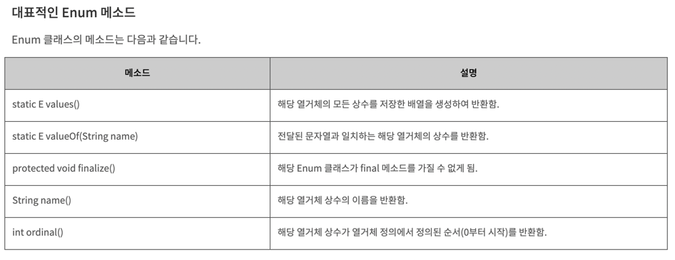
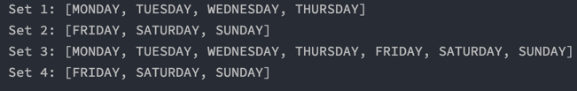

# week 11. Enum

### 11-1. enum 정의하는 방법

enum 이란 무엇일까? 

enum이란 관련 있는 상수들의 집합을 의미한다. 즉 우리는 예전에 상수에 관해서 공부를 한 적이 있는데, 이런 상수들의 집합을 enum이라고 한다.

일단 우리가 평소에 상수를 추가하는 방법을 확인해 보도록 하자.

```
public class Main {
    static final int MONDAY = 1;
    static final int TUESDAY = 2;
    static final int WEDNESDAY = 3;
    static final int THURSDAY = 4;
    static final int FRIDAY = 5;
    static final int SATURDAY = 6;
    static final int SUNDAY = 7;

    public static void main(String[] args) {
        System.out.println(MONDAY);
    }
}
```

월요일부터 일요일까지의 값을 상수로 선언하였다. 과연 이 방법이 안좋은 이유는 무엇일까?

만약 위의 상수에 더 많은 정보들(예를들어 시간이나 달)을 추가 하려면 소스코드가 길어지게 되고 가독성도 떨어지게 된다.

추가적으로 상수명이 중복되는 경우에는 이는 에러가 날 수 있다.

그렇다면 enum을 사용하면 어떻게 될까?

```
public class Main {
    enum Day {
        MONDAY, TUESDAY, WEDNESDAY, THURSDAY, FRIDAY, SATURDAY, SUNDAY
    }

    public static void main(String[] args) {
        System.out.println(Day.MONDAY);
    }
}
```

코드가 훨씬 간결해 진 것을 볼 수 있다. 다음은 enum을 사용 했을 때의 장점이다.

> * 코드가 단순해 진다.
> * 인스턴스 생성을 방지 할 수 있다. (interface나 class로 상수 집합을 생성 할 경우를 방지)
> * enum 키워드를 통해 열거형 상수임을 정의 할 수 있다(의도 파악이 쉽다).
> * 내부적으로 상수 키워드인 public static final이 생략 된 것이기에 컴파일 타임에 JVM에서 메모리에 할당 함으로 프로그램 종료 전에 언제든 사용 가능하다.

enum은 class처럼 생성자를 가질 수 있다.
하지만 고정된 상수의 집합임으로 런타임이 아닌 컴파일 타임에 모든 값을 가지고 있어야 하기에 private로 선언되어야 한다.

즉 런타임에 동적으로 생성자를 외부에서 주입 받아 생성이 될 수 없기에 private으로 컴파일 타임에 생성자가 실행 되어야 한다는 것이다.

### 11-2. enum이 제공하는 메소드 (values()와 valueOf())

values 메소드는 enum의 요소들을 enum 타입의 배열로 리턴한다.

ENUM$VALUES의 카피이므로, 너무 자주 호출하는 것은 좋지 않음.

```
public class Main {
    enum Day {
        MONDAY, TUESDAY, WEDNESDAY, THURSDAY, FRIDAY, SATURDAY, SUNDAY
    }

    public static void main(String[] args) {
        Stream.of(Day.values()).forEach(System.out::println);
    }
}
```


valueOf() 메소드는 매개변수로 받은 값이 존재 한다면 enum의 상수 스트링을 리턴한다. String에 해당하는 Enum 상수가 없다면 IllegalArgumentException 익셉션을 던진다.

```
public class Main {
    enum Day {
        MONDAY, TUESDAY, WEDNESDAY, THURSDAY, FRIDAY, SATURDAY, SUNDAY
    }

    public static void main(String[] args) {
        System.out.println(Day.valueOf("MONDAY")); //MONDAY 출
    }
}
```

### 11-3. java.lang.Enum

다음은 Enum 클래스를 알아 보도록 하자. Enum 클래스들에는 다양한 메소드들이 존재 한다.




### 11-4. EnumSet

EnumSet은 열거형 타입으로 지정해놓은 요소들을 가장 쉽고 빠르게 배열처럼 요소들을 다룰수 있는 기능을 제공한다.

EnumSet은 다른 컬렉션들과 다르게 new 연산자 사용이 불가능하다.

EnumSet은 기술상으로 원소갯수가 2^6 그러니까 64개를 넘지 않을 경우에 겉은 Set 기반이지만 내부적으로 long 데이터형의 비트필드를 사용하게 된다.

```
public abstract class EnumSet { //EnumSet은 abstract하여 객체 생성이 불가능
    ...
    
    public static noneOf(...) {
        if (enumElementSize <= 64)
            return new RegularEnumSet<>(...);  
        else
            return new JumboEnumSet<>(...);
    }
}
```

위의 코드에서 볼 수 있듯이 사이즈를 토대로 분기 처리가 되어 있다.
(비트 필드 대신 EnumSet을 사용하라)

```
import java.util.EnumSet;
import java.util.Set;

public class Main {
    enum Day {
        MONDAY, TUESDAY, WEDNESDAY, THURSDAY, FRIDAY, SATURDAY, SUNDAY
    }

    public static void main(String[] args) {
        // Creating a set 
        EnumSet<Day> set1, set2, set3, set4;

        // Adding elements 
        set1 = EnumSet.of(Day.MONDAY, Day.TUESDAY,
                Day.WEDNESDAY, Day.THURSDAY);
        set2 = EnumSet.complementOf(set1);
        set3 = EnumSet.allOf(Day.class);
        set4 = EnumSet.range(Day.FRIDAY, Day.SUNDAY);
        System.out.println("Set 1: " + set1);
        System.out.println("Set 2: " + set2);
        System.out.println("Set 3: " + set3);
        System.out.println("Set 4: " + set4);
    }
}
```



Set 콜렉션을 생성하고 출력하는 예제이다.

