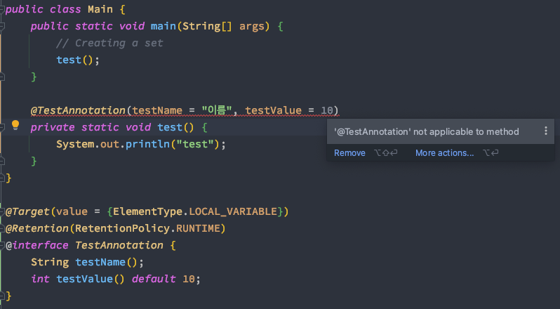
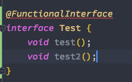

# week 12. 애노테이션

### 12-1. 애노테이션 정의하는 방법

애노테이션이란 자바 1.5 부터 사용된 것으로 의미를 해석하면 `주석`이라는 뜻을 가지고 있다.

하지만 // /**/ 와 같은 주석과는 다른 개념이라고 생각하면 된다.

애노테이션은 주석과 달리 설명 + 속성을 부여하는 것으로 생각하면 된다.

```
@Override
public void print() {
    //something
}
```

위의 애노테이션은 선언한 메소드가 오버라이드 된 것임을 나타내는 애노테이션이다. 애노테이션은 애노테이션만으로는 어떠한 동작을 하지 않는다. 즉 주석과 마찬가지로 애노테이션이 코드의 흐름에 영향을 주진 않는다.

하지만 애노테이션을 붙임으로써 컴파일러에게 에러 체크를 할 수 있도록 정보를 제공하거나, 코드를 자동으로 생성하는 등의 동작들이 가능하다.

일례로 위의 @Override 애노테이션의 경우 부모 클래스에 해당 메소드가 없다면 컴파일 에러를 발생 시키게 된다.

다음은 애노테이션을 새롭게 정의 해 보도록 하자.

```
public class Main {
    public static void main(String[] args) {
        // Creating a set

        @TestAnnotation(testName = "이름", testValue = 10)
        int value = 10;
    }
}

@Target(value = {ElementType.LOCAL_VARIABLE})
@interface TestAnnotation {
    String testName();
    int testValue() default 10; //디폴트값 10
}
```

@interface를 이용하여 새로운 애노테이션을 생성 할 수 있으며 정의 된 애노테이션의 element들을 생성 할 수 있으며, 생성된 요소들은 `@TestAnnotation(testName = "이름", testValue = 10)` 식으로 사용이 가능하다.

애노테이션들의 요소는 기본형, String, Enum, 애노테이션, Class만 허용되며 testValue() 안에 매개변수를 넣을 수 없다.
또한 예외 또한 선언이 불가능하다.

@Target에 관해서는 아래에서 파악해보자.

### 12-2. @retention

@retention 애노테이션은 생성 된 애노테이션을 어디까지 보유 할 것인가를 뜻한다.

다음은 @retention 애노테이션의 도큐멘트이다.

```
/**
  * Indicates how long annotations with the annotated type are to
  * be retained.  If no Retention annotation is present on
  * an annotation type declaration, the retention policy defaults to
  * {@code RetentionPolicy.CLASS}.
  *
  * <p>A Retention meta-annotation has effect only if the
  * meta-annotated type is used directly for annotation.  It has no
  * effect if the meta-annotated type is used as a member type in
  * another annotation type.
  *
  * @author  Joshua Bloch
  * @since 1.5
  * @jls 9.6.3.2 @Retention
  */
```

RetentionPolicy을 통해 해당 애노테이션을 어디까지 보유 할 것인지 결정한다. 그렇다면 정책으론 어떤 정책이 있는지 살펴보도록 하자.

>* SOURCE : 애노테이션을 사실상 주석처럼 사용하는 것. 소스까지만 애노테이션이 유지 됨

>* CLASS : 디폴트 값. 컴파일러가 컴파일에서는 어노테이션의 메모리를 가져가지만 실질적으로 런타임시에는 사라지게 됨. 리플렉션으로 선언된 어노테이션 데이터를 가져올 수 없게 됨

>* RUNTIME : 어노테이션을 런타임까지 사용


### 12-3. @target

@Target 애노테이션을 통해 어떤 타입에 애노테이션을 붙일 수 있는지를 정의 할 수 있다.

> * TYPE : 클래스, 인터페이스, enum
> * ANNOTATION_TYPE : 어노테이션
> * FIELD : 필드
> * CONSTRUCTOR: 생성자
> * METHOD: 메소드
> * LOCAL_VARIABLE: 로컬 변수
> * PACKAGE: 패키지

위의 타입에 맞지 않은 곳에 애노테이션을 붙일 경우 컴파일 에러를 발생 시키게 된다.



@Target 애노테이션은 여러개를 붙일 수 있다.


### 12-4. @documented

@documented 애노테이션은 javadoc 및 같은 툴에 의해 디폴트로 문서화 되는 것을 나타낸다.

해당 애노테이션을 사용하는 클래스가 javadoc으로 문서화 될 때 해당 어노테이션이 적용 되었음을 명시화한다.

@documented와 같은 애노테이션을 메타 애노테이션이라고 하며 이는 애노테이션을 위한 애노테이션을 뜻하며 애노테이션을 설명하기 위하여 사용이 된다.

추가적으로

>* @Inherited: 자식 클래스에게도 애노테이션이 정의 되도록 한다.
>* @Repeatable: 애노테이션을 반복적으로 선언 가능도록 한다.
>* @Deprecated: 해당 애노테이션이 붙은 메소드나 클래스는 이제 더 이상 사용 되지 않는 것을 뜻한다. (다른 메소드나 클래스를 사용하도록 권장한다)
>* @FunctionalInterface: 함수형 인터페이스를 뜻한다. 함수형 인터페이스는 인터페이스에 1개의 추상 메소드가 있는 것을 뜻하는데, 해당 애노테이션이 있지만 추상 메소드가 2개인 경우 컴파일 에러가 된다.

의 애노테이션들 등등이 있다.




### 12-5. 애노테이션 프로세서

애노테이션 프로세서는 AbstractProcessor를 상속받아 구현한다. 주요 메소드들을 확인해보자.

> * process Method: 각 프로세서의 main 메서드와 같은 역할을 한다. 이 메서드에 원하는 코드를 작성하면 된다.
> * getSupportedAnnotationTypes: 이 프로세서가 처리할 어노테이션들을 명시한다. 이 메서드는 어노테이션을 대체할 수 있다.(Java 1.7이상)
> * getSupportedSourceVersion: 특정 자바버전을 명시하는데 사용할 수 있으며, 위와 마찬가지로 어노테이션으로 대체 가능하다.(Java 1.7이상) 애노테이션으로 사용 할 경우 특정 버전을 명시해줘야 한다.
> * init(ProcessingEnvironment processingEnvironment): 모든 어노테이션 프로세서는 기본 생성자를 가져야한다. 대신 init 메서드를 사용할 수 있는데, ProcessingEnvironment에서 상당히 유용한 유틸 클래스들을 제공한다.

컴파일 타임에 애노테이션의 소스코드를 분석하고 처리한다. 컴파일 타임에 어떻게 자바 컴파일러가 애노테이션 프로세서가 있는지 체크가 가능할까?

.jar 파일들을 보면 (애노테이션 프로세서가 포함되어 있는) .jar 파일 안에 META-INF/services 폴더가 있고 그 안에 javax.annotation.processing.Processor의 파일이 있는것을 확인 할 수 있다.

이 파일이 바로 AbstractProcessor를 상속받아 구현된 파일이다. 이 파일이 구현되어 있기 때문에 컴파일러가 컴파일 타임에 해당 애노테이션 프로세서를 실행 시킬 수 있는 것이다.


