# week 15. 람다식

### 15-1. 람다식 사용법

람다식은 java 1.8 부터 등장하였고 자바에 많은 변화를 일으켰다고 생각한다.

람다의 등장 이후 코드는 많이 간결해 졌으며, 함수형 프로그래밍 또한 가능하게 되었다. 람다를 사용하면 클래스를 생성하거나 객체를 생성하는 등의 코드를 생성하지 않고도 함수를 실행 할 수 있으며 람다식을 통해 매개변수로 메소드를 넣는 등의 방법까지 가능하게 되었다.

람다를 통해 간결성, 유연성을 높이는 코드를 작성 할 수 있어 많은 사람들이 자바8의 큰 변화로 람다를 꼽기도 한다.

그렇다면 람다는 어떻게 사용 할 수 있을까?

아주 간단한 예제를 보도록 하자.

```
int max(int a, int b) {
    return a > b ? a : b;
}
```

위의 예제는 a와 b중 큰 값을 리턴해주는 메소드이다. 그렇다면 이 식을 람다로 표현하면 어떻게 될까?

> (a, b) -> a > b ? a : b;

이 람다식은 익명함수라고 하며 반환 타입과 메소드의 이름을 지워 표현하게 된다.

> 메소드와 함수의 차이점은?
> * 메소드는 클래스에 종속적
> * 함수는 클래스에 독립적
> * 자바에서 메소드는 클래스 내부에서 선언되기에 모두 메소드 이다.

람다식을 작성할 때는 몇 가지 규칙을 따르면 되는데 그 규칙을 한번 알아보자.

1. 메서드의 이름과 return 타입을 제거하고 '->'를 {} 블록 앞에 붙인다.  
   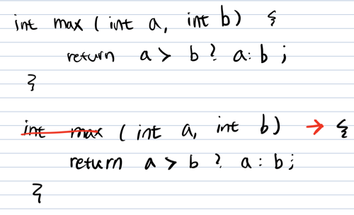  
2. 반환값이 있는 경우, 식이나 값만 적고 return문 생략 가능   
   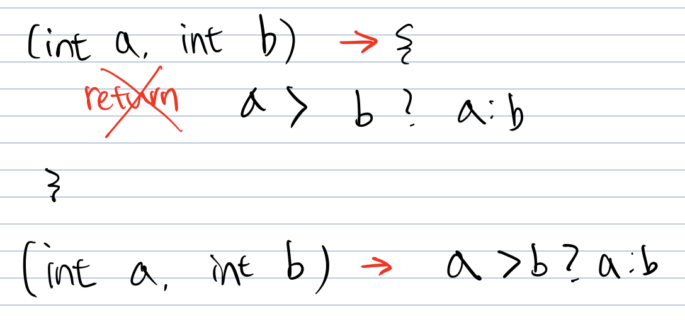
3. 매개변수의 타입이 추론이 가능하면 생략가능
   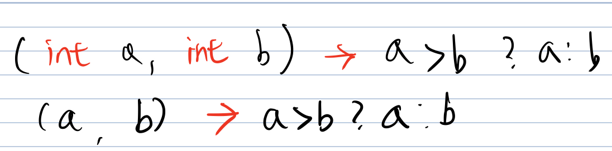

결국 위의 식은

```
(a, b) -> a > b ? a : b
```
가 된다.


자바에서는 메소드가 따로 존재 할 수 없기 때문에 람다식은 **익명 함수가 아니라 익명 객체**이다.

즉 우리가 보았던 이 식은

>(a, b) -> a > b ? a : b

```
new Object() {
   int max(int a, int b) {
       return a > b ? a : b;
   }
}
```

이다. 이는 익명 클래스, 익명 객체이며 객체의 선언과 생성을 동시에 하는 것이다.

하지만 익명 객체의 경우에는 이를 사용하기 위해 참조 변수가 필요한데, 위와 같이 new Object()로 생성하게 된다면 에러가 나게 된다.  

왜냐하면 Object 클래스에서는 max라는 메소드가 없기 때문이다. 우린 이 에러를 해결하기 위해 함수형 인터페이스를 사용하게 된다.

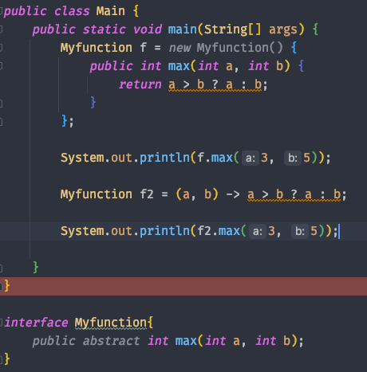

위의 식에서 보듯이 함수형 인터페이스를 선언하고 람다식을 이용해 f2를 선언하였다.

f도 틀린 문법이 아니지만 람다식을 확인하기 위해 f2를 예시로 보였다.


### 15-2. 함수형 인터페이스

함수형 인터페이스란 과연 어떤것일까?

함수형 인터페이스는 인터페이스에 추상 메소드가 1개인 인터페이스를 의미한다.

만약 메소드가 2개라면 함수형 인터페이스가 아니게 된다. 애노테이션을 이용하여 한번 확인 해 보도록 하자.

인터페이스는 위에서 선언한 MyFunction을 사용 하기로 한다.

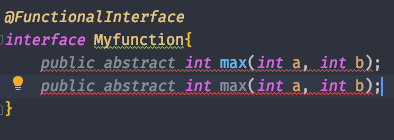

@FunctionalInterface 애노테이션은 함수형 인터페이스라고 알려주는 역할이며 만약 함수형 인터페이스의 규격에 어긋난다면 컴파일러가 에러임을 알려주게 된다.

위의 예시에서도 추상 메서드를 2개로 선언한 순간 에러임을 표기해준다.

그렇다면 함수형 인터페이스는 왜 만들어졌을까? 

자바에서 함수형 인터페이스는 람다식의 접근을 위함이며 람다식이 함수형 인터페이스로 구현되어 있기 때문이다.

함수형 인터페이스를 통해 함수형 프로그래밍 또한 가능하게 되었다고 생각하며 이는 아래에서 좀 더 다뤄 보도록 하자.

자바에서 기본적으로 제공하는 함수형 인터페이스는 다음과 같다.

>* Supplier  
>* Consumer  
>* Function<T, R>  
>* Predicate  

하나하나 살펴 보도록 하자.

* Supplier  
   인자를 받지 않고 리턴만 해 준다.

   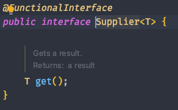    

  ```
     public class Main {
       public static void main(String[] args) {
           Supplier<String> s = () -> "hi"; 
           System.out.println(s.get()); //hi 출력
       }
   }
  ```
  
* Consumer
   인자를 받고 아무것도 리턴하지 않는다.  

  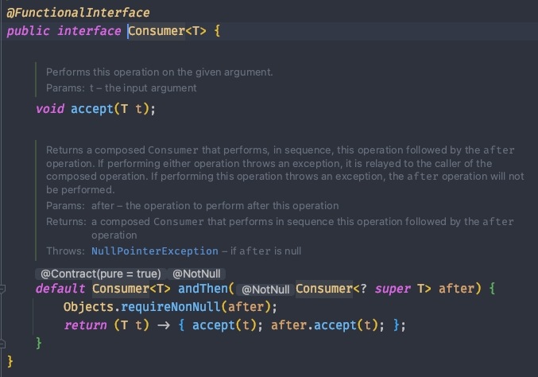  

  ```
     public class Main {
       public static void main(String[] args) {
           Consumer<String> printString = arg -> System.out.println("hi " + arg);
           printString.accept("test"); //hi test 출력
       }
   }
  ```
  
* Function<T, R>
   T타입의 인자를 받고 R타입으로 리턴한다.  

  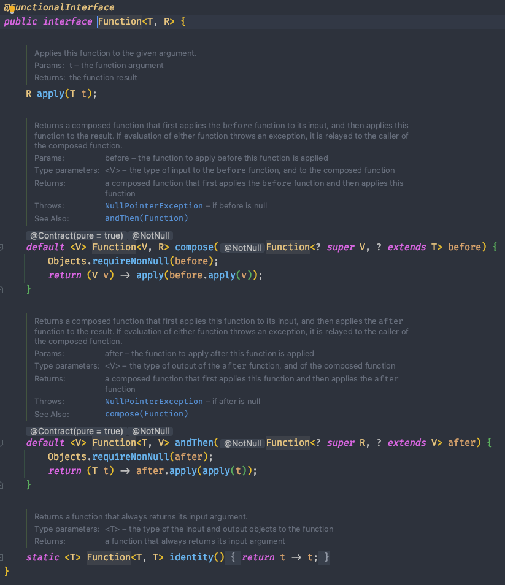  
  
   ```
     public class Main {
       public static void main(String[] args) {
           Function<Integer, Double> f = (v) -> v * 2.0;
           System.out.println(f.apply(3)); //6.0 출력
       }
   }
  ```
  
* Predicate
   인자를 받고 boolean 리턴  
  
  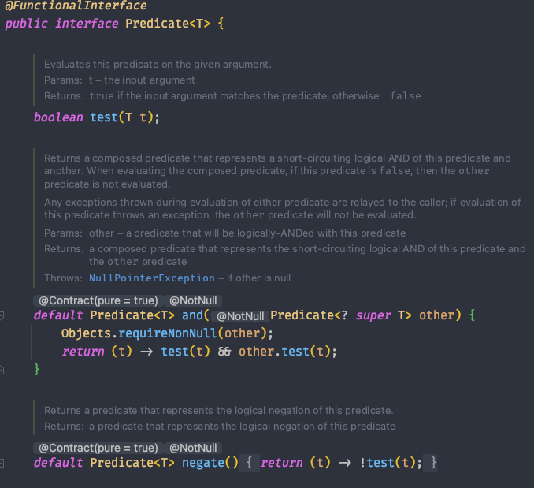   
  (함수들이 더 있지만 길어서 생략한다)
  ```
     public class Main {
       public static void main(String[] args) {
           Predicate<Integer> p = (v) -> 3 > v;
           System.out.println(p.test(22)); //false 출력
       }
   }
  ```

이처럼 자바에서 제공하는 기본적인 함수형 인터페이스를 통하여 람다식을 구현 할 수 있다.

하지만 이는 기본적으로 제공하는 자바의 함수형 인터페이스이며 우리는 이와 비슷하게 함수형 인터페이스를 구현하고 람다식으로 구현이 가능하다.


함수형 인터페이스를 통해 우리는 함수를 1급 시민으로 처리가 가능하며 이는 함수를 하나의 값으로 취급하여 함수형 프로그래밍의 패러다임에 접근하는 것이라고 생각한다.

때문에 이는 java로 함수형 프로그래밍이 가능하다는 것이 가장 큰 특징이 아닐까?

그렇다면 함수형 프로그래밍을 간단히 살펴보도록 하자.

> 함수형 프로그래밍의 컨셉   
>* 불변성(Immutability)  
>* 일급 시민(First class)
>* 고차 함수(Higher-order Functions)
>* 지연연산(Lazy evaluation)   

불변 상태로 만든다는 것은 입력값이 동일하면 출력값 또한 마찬가지로 같아야 한다는 의미이며, 이는 수학적 함수를 떠올리면 된다. 즉 순수함수를 통하여 부수적인 오류를 제거하는 것이다.

또한 일급 시민으로써의 함수는 인자로 전달이 가능해야 하며, 리턴으로 함수를 리턴 가능해야하고 변수에 함수를 할당 할 수 있어야 한다.

위의 예제에서 보듯이 Myfunction f을 통해 변수에 함수를 넣었었는데, 이 또한 함수형 인터페이스를 사용 함으로써 가능한 부분이다.

고차함수란 함수에 함수를 전달하여 만든 새로운 함수를 뜻하며 이를 통해 프로그램을 더욱 간결하게 작성이 가능하다. 

지연 연산이란 어떤 값이 실제로 쓰이기 전까지는 연산을 하지 않고 필요할 때 연산을 하는 방식이다. 

java를 통해 위에서 언급한 패러다임을들 적용 할 수 있을지 한번 또 고민해 보도록 하자.


### 15-3. Variable Capture

람다의 바디에서는 외부의 변수를 사용 할 수 있다.

즉 아래의 예시와 같이 int a를 선언하고 a를 람다 바디에서 사용 가능하다. 

람다의 {} 내부에서도 이 변수를 사용 할 수 있을까? 확인해보도록 하자.

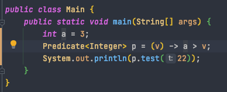

전혀 문제가 없다. 그렇다면 이 값을 바꿔보도록 하자.

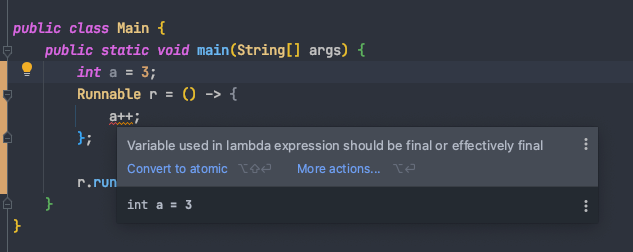

컴파일 에러가 나고 있다. 왜 일까?

>Variable used in lambda expression should be final or effectively final

이라는 메시지가 나오는데, 람다 식에서는 final 또는 effectively final이어야 한다는 뜻이다. 이 에러 메시지는 왜 등장하는 것일까?

일단 effectively final의 의미에 대해 알아보도록 하자.

effectively final 이란 초기화 된 이후에 값이 한번도 변경되지 않은 경우를 뜻하는데, final 키워드를 붙이지 않았더라도 값이 변경되지 않았다면 effectively final 하다 라고 말할 수 있는 것이다.

그렇다면 왜 effectively final 해야 할까? 

자바에서 람다는 람다를 실행시키는 쓰레드에서 지역변수를 복사하여 사용을 한다. 즉 힙 영역이 아닌 스택 영역을 참고하게 되는데, 이 때 변수가 스택에서 사라질 경우가 발생 할 수도 있다.

이런 경우를 대비하여 자바에서는 람다 쓰레드가 해당 지역변수의 값을 복사하게 되는데, 이 때 복사한 값이 변경 되면 안되기 때문에 effectively final 하게 되어야 하는 것이다.

이렇게 람다에서 외부 지역변수를 참조 하는 행위를 **Lambda Capturing** 이라고 부른다.


### 15-4. 메소드, 생성자 레퍼런스

우리는 앞서 익명 클래스를 통한 람다식의 표현을 보았다.

익명클래스를 만들고 사용 할 수도 있지만 이미 만들어져 있는 익명 클래스를 사용하는 방법이 있는데 이를 메소드 참조라고 한다.

예를 들어보도록 하자.

```
public class Main {
    public static void main(String[] args) {
        int[] a = {1, 2, 3, 4, 5};

        Arrays.stream(a).forEach(x -> System.out.println(x));
    }
}
```

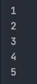

위 예제는 foreach로 배열 a를 출력하는 것이다.  
우리는 여기서 람다식 문법을 확인 할 수 있다. 그렇다면 이 문법을 어떻게 메소드 참조로 바꾼다는 걸까?

```
public class Main {
    public static void main(String[] args) {
        int[] a = {1, 2, 3, 4, 5};

        Arrays.stream(a).forEach(System.out::println);
    }
}
```
위의 식에서 좀 더 간결하게 System.out::println 이라는 문법으로 같은 결과를 출력 할 수 있다.


이처럼 클래스의 이름과 :: 메소드를 분리시켜 표현하게 되며 아래 정리 된 내용은 메소드 레퍼런스를 사용하는 방식이다.

위의 println의 식의 경우 객체를 생성하진 않았지만 인스턴스 메소드를 호출 한 것으로 생각 할 수 있다.


>클래스::인스턴스메소드 
>클래스::정적메소드  
>~~특정객체::인스턴스메소드 (잘 사용하지 않는다)~~

다음은 리스트에서 가장 큰 값을 출력하는 예제이다.

```
public class Main {
    public static void main(String[] args) {
        List<Integer> s = new ArrayList<>();

        s.add(1);
        s.add(999);
        s.add(2);

        Optional<Integer> value = s.stream().reduce(Math::max);
        value.ifPresent(System.out::println); //999 출력
    }
}
```

Optional<Integer>의 의미는 null 값일 수 없다는 의미로 생각하자.

Math::max는 정적 메소드의 예제가 된다.

실제로 Math 클래스의 max 메소드를 참고해 보도록 하자.

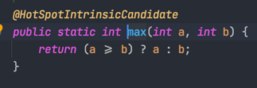

메소드가 static, 정적 메소드로 선언 된 것을 확인 할 수 있다.

그렇다면 생성자 메소드 참조란 무엇일까?

클래스를 생성 할 때 우리는 생성자를 호출하게 되며, 

클래스::new 라는 문법을 사용하여 매개변수에 맞는 생성자를 호출하는 방식이다.

다음 예제를 보도록 하자.

```
class Test {
    Test() {
        System.out.println("new");
    }

    Test (String s ) {
        System.out.println("new2");
    }
}

public class Main {
    public static void main(String[] args) {
        Supplier<Test> t1 = Test::new;
        Function<String, Test> t2 = Test::new;
        t1.get();
        t2.apply("test");
    }
}
```

첫번째 t1의 경우 Supplier 함수형 인터페이스로 선언되어 있는데 아시다시피 Supplier는 리턴만 해준다.

즉 생성자 호출 시 매개변수에 아무런 값도 없다는 뜻이다.

하지만 Function을 보도록하자. 우리는 생성자를 호출 할 때 매개변수로 String s 가 선언되어 있는 생성자를 구현하였으며 Function 함수형 인터페이스를 선언을 하였다.

이 때 매개변수로 String s로 받는 생성자가 호출이 되며 이런 방식을 생성자의 메소드참조라고 부른다.

비슷한 예로 배열 선언을 보도록 하자.

```
public class Main {
    public static void main(String[] args) {
        Function<Integer, int[]> f = int[]::new;
        int[] arr = f.apply(10);
        System.out.println(arr.length);
    }
}
```
생성자 메소드 참조를 통하여 값 10을 넣어 주었는데, 예상한대로 arr의 길이는 10이 나올까?

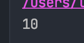

예상한대로 10이 나오게 되었다.


> 참고
> * 남궁성님의 자바의 정석 유튜브 (https://www.youtube.com/watch?v=3wnmgM4qK30&t=942s&ab_channel=%EB%82%A8%EA%B6%81%EC%84%B1%EC%9D%98%EC%A0%95%EC%84%9D%EC%BD%94%EB%94%A9)