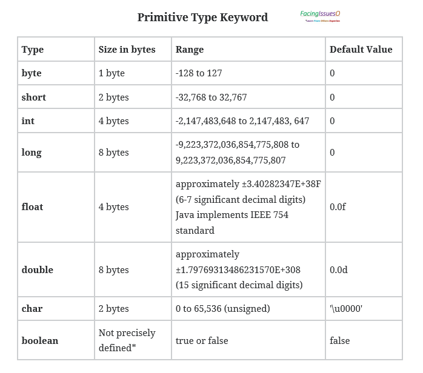
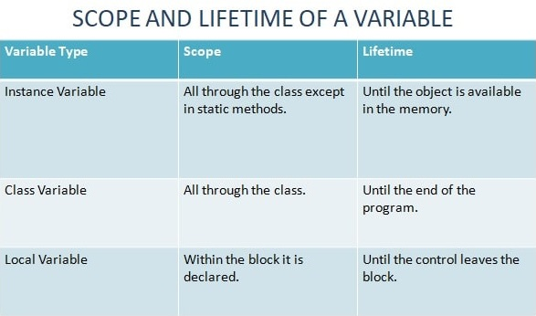

# week 02. 자바 데이터 타입, 변수 그리고 배열

### 2-1. 프리미티브 타입 종류와 값의 범위 그리고 기본 값
자바 프리미티브 타입이랑 int, char, byte와 같이 기본적인 자료형에 속한다.
다음 내용은 자바 프리미티브 타입의 종류와 범위를 나타낸 표이다.


아래 내용은 각 프리미티브 타입의 속성이다. (숫자형, 문자형 그리고 불린형이라고 생각하자)

Numeric Primitive: short, int, long, float and double. These primitive data types can hold only numeric data. We can perform arithmetic and comparison operations with this data. </br>
Textual Primitive: byte and char. These primitive data type can hold characters. We can perform the operation as compare character, add characters to make words, etc. byte and char also used for arithmetic operations </br>
Boolean and null primitives: boolean and null.

프리미티브 타입은 값 자체를 리터럴로 저장을 시킨다.
리터럴에 대한 설명은 아래를 2-3 리터럴을 참고하자.

### 2-2. 프리미티브 타입과 레퍼런스 타입
그렇다면 프리미티브 타입과 레퍼런스 타입의 정확한 차이점은 무엇일까?
프리미티브 타입은 실제로 해당 값이 저장이 된다. 즉 
```
int a = 15;
```
라고 했을 때 a의 값은 15로 저장이 된다는 뜻이다.
그렇지만 레퍼런스 타입은 메모리 주소를 참조하여 해당 값을 저장한다.

```
String s = "123";
```
이라고 한다면 s의 값인 "123"이 저장되는 것이 아닌 "123"의 값을 가진 객체가 저장이 되고 s는 그 객체를 참조하게 된다.
즉 s는 "123"의 값을 가진 객체를 참조하고 있는 것이다.


### 2-3. 리터럴
리터럴 이란 데어터의 값 그 자체를 의마한다.
```
int a = 1;
```
에서 리터러를 이 1을 설명한다. 
좀 더 명확한 설명을 위해 위키피디아 내용을 참고하여 보자

컴퓨터 과학 분야에서 리터럴(literal)이란 소스 코드의 고정된 값을 대표하는 용어다. 거의 모든 프로그래밍 언어는 정수, 부동소수점 숫자, 문자열, 불린 자료형과 같은 용어를 가지고 있다. 어떤 언어는 열거 타입이나, 배열, 자료형, 객체와 같은 용어도 있다. 리터럴과 대조적으로, 고정된 값을 가질 수 있는 변수나 변경되지 않는 상수가 있다.

즉 프리미티브 타입인 int의 변수 a에 담을 저 1 값 자체를 바로 리터럴이라고 칭하는 것이다.


### 2-4. 변수 선언 및 초기화하는 방법

프리미티브 타입의 변수 선언은 프리미티브 타입과 사용 할 변수명을 타이핑 해주면 된다.
```
int a;
```
위의 코드는 변수 a를 선언한 코드이다.  
다음은 이 값을 초기화 해보자

```
a = 1;
```
a의 값에 1의 리터럴 값을 넣어 주었다. 즉 a == 1 이 된 상황이다.  
하지만 이 두 줄을 한 줄로 줄여서 코딩이 가능하다. 위의 예제에서 보았던 것 처럼 한 줄에 변수를 선언하면서 초기화를 해 보도록 하자.

```
int a = 1;
```
변수 a를 선언하면서 동시에 1의 리터럴 값을 초기화 하였다.

다음은 변수를 여러개 선언하여 보자.
```
int a, b, c;
```
마찬가지로 해당 선언에 초기화도 가능 하다.
```
int a = 10, b = 20, c = 30;
```

다음은 레퍼런스 타입의 초기화를 해 보도록 하자.

다음은 객체를 참조하는 레퍼런스 타입의 선언이다. (초기화가 아니다)
```
String s; // or Stirng s = null; (아무런 값도 없음을 의미)
```
해당 변수 s는 아직까지 초기화가 되지 않은 상태이다.
레퍼런스 타입은 객체를 참조한다고 하였기 때문에 new 연산자를 통해 메모리를 할당 해 주어야 한다.
메모리를 할당해 주도록 하자
```
String s;
s = new Stirng();
```
메모리를 할당 받았지만 해당 내용은 아무것도 없을 것이다.
따라서 값 하나를 주도록 하자.
```
String s = new Stirng();
s = "";
```
자 이제 레퍼런스 타입의 변수 s는 "" 의 값을 가진 객체를 참조하고 있게 되었다.
프리미티브 타입과 마찬 가지로 레퍼런스 타입 또한 선언과 초기화 모두 가능하다.
```
String s = "123";
```
위에 예제를 보면 새로 new를 하지 않고 "123"값("123"은 리터럴 값이다)을 주도록 하였다.
이 부분은 괜찮은 것일까?

위의 방식에는 차이점이 존재한다.

* 먼저 new 연산자를 활용할 경우에는 해당 String은 Heap 메모리 상에 메모리를 할당하여 해당 내용을 저장하 메모리 주소를 참조하게 된다.
* 하지만 리터럴 값을 넣을 경우에는 String Pool에 저장된 메모리를 확인을 하고, 동일한 데이터가 있다면 해당 주소를 참조 한다.
String Pool 이란 Heap 내에 문자열을 저장하는 Pool이다.

리터럴의 저장하는 방식과 new를 이용한 메모리 할당의 방식의 차이에 대해 기억해두자.


### 2-5. 변수의 스코프와 라이프타임

소코프란 무엇일까?
우리가 자바를 개발을 할 때 사용하는 중괄호 즉 {} 를 의미한다. 보통 영역이라고 표현한다.
이 영역 안에서 우리는 코드를 작성하게 되고 해당 스코드를 벗어나면 변수의 라이프타임이 종료 되기도 존재하기도 한다.
좀 더 자세히 알아보도록 하자.

변수의 라이프타임이란 변수가 메모리에서 존재하는 기간이라고 생각하면 된다.

다음 메소드를 봐보도록 하자.

```
public void test() {
    int a = 1;
    System.out.println(a);
}
```
위의 코드는 변수 a를 선언 및 초기화 하였다. 그렇다면 변수 a의 라이프타임은 어떻게 될까?
바로 스코프 안쪽이며 해당 메소드가 호츨되고 난 뒤에는 메모리에서 존재하지 않게 된다.  
이를 지역변수라고 한다.

그렇다면 지역변수가 아닌 변수들의 라이프 타임은 어떻게 될까?
지역변수가 아닌 변수들은 클래스 변수와 인스턴스 변수가 존재한다. 해당 이름을 기억해두고 



인스턴스 변수의 경우 스태틱 메소드를 제외한 클래스에서 스코프 범위가 유효하며 라이프 타임은 객체가 메모리 안에서 유효할때 까지이며,  
클래스 변수는 클래스 전체의 스코프를 가지며 프로그램이 끝날 때 까지 라이프타임이 유효하다.  
지역 변수는 앞서 말한거와 같이 블락안에서 유효하며 블락을 떠나게 될 때(즉 {}를 벗어나게 될 때) 라이프타임이 종료된다.

변수의 이해를 돕기 위해 아래 코드를 확인하여 보자.

```
// 변수 선언 방법과 선언 된 변수가 어떤 변수인지 확인하여 보자.
public class scope_and_lifetime {
    int num1, num2;   //Instance Variables
    static int result;  //Class Variable
    int add(int a, int b){  //Local Variables
        num1 = a;
        num2 = b;
        return a+b;
    }
    public static void main(String args[]){
        scope_and_lifetime ob = new scope_and_lifetime();
        result = ob.add(10, 20);
        System.out.println("Sum = " + result);
    }
}
```

### 2-6. 타입 변환, 캐스팅 그리고 타입 프로모션

타입 변환이란 변수가 가진 타입을 변환 시키는 것이다.
즉 int -> long 이나 byte -> char로 변환 시키는 것을 의미한다.  
프리미티브 타입의 변수들은 서로 형 변환이 가능하다.

자바의 타입 변환에는 묵시적 변환과 명시적 변환이 존재한다.  
묵시적 변환은 자동 변환이라고 하며 명시적 변환은 강제 변환이라고 한다.

이는 다른 언어로 표현이 가능한데 이것이 바로 캐스팅과 프로모션이다.

__자동 형변환은, 즉 묵시적 형 변환은 프로모션이라고 불리우며
강제 형변환은, 즉 명시적 형 변환은 캐스팅이라고 불리운다.__

* 자동타입 변환 (프로모션) :: 작은 타입에서 큰 타입으로 변환   
  자동 타입의 변환은 프로그램 실행 도중 발생한다. 또한 작은 타입의 데이터가 큰 타입의 데이터로 변환이 되는 것을 뜻한다.  
**byte < short < int < long < float < double**
    ```
        int i = 10;
        float f = i; // 20.0 
    ```

* 강제타입 변환(캐스팅) :: 큰 타입에서 작은 타입으로 변환   
큰 크기의 타입은 작은 타입으로 변할 수 없다. 하지만 강제로 변환이 가능하다.
  ```
  int val = 10;
  byte b = (byte) val;
  ```
  이 경우 b의 값은 원래의 val 값과 다르게 되는데 (작은 타입으로 변환 하였기 때문)
  int는 4byte이고 b는 1byte만 저장하기 때문에 1byte를 제외한 값들은 버려지게 되는 것이다.  
  만약 int가 1byte라면 해당 값은 잘 저장 될 것이다.  
  또한 강제로 타입을 변환하는 경우는 아래 코드와 같다.
  ```
  int i = 'A';
  System.out.println(i); // 아스키 코드 값 65 출력 됨
  ```
  이 외로도 소수점을 사용하는 float이나 double의 경우 int형으로 변환하기 위해 (int)를 활용하여 강제로 타입 변환을 해야 한다.
  ```  
  float f = 12.01f;
  int i = (int) f;
  System.out.println(i); //12출력 (정수형이기 때문에 소수점 버림)
  ```

### 2-7. 1차 및 2차 배열 선언하기

배열이란 같은 타입의 데이터를 하나의 변수로 그루핑 하는 것이다. 다음 예제를 확인하여 보자.
```
int[] arr; //1차원 배열의 선언
int arr[]; //Java에서는 위의 형식을 주로 사용한다.
```
위의 코드는 프리미티브 타입인 int형의 배열 a를 선언한 것이다.
이는 가장 기본적인 자료구조이며 인덱스를 통하여 배열 a안에 int형 값들을 추가하여 그루핑이 가능하다.
```
a = new int[5];
```
위의 코드는 배열 a에 5개의 인덱스를 가질 수 있는 사이즈로 초기화를 한 것이다.
인덱스의 접근은 [0], [1] 식으로 표현되며 시작은 0번 부터 임을 유의하자.

그럼 위의 변수와 마찬가지로 선언과 동시에 초기화가 가능할까?

```
int[] a = new int[]{1,2,3,4,5};
System.out.println(a[0]); //1 출력
```
자 위는 1,2,3,4,5의 원소를 가진 배열 a를 선언과 동시에 초기화 한 것이다.
자동으로 사이즈가 5이며 마찬가지로 [0], [1] ... [4] 까지의 인덱스를 통해 접근이 가능하다.(0번째 부터 시작이기 때문에 마지막은 4이다)

위의 방법 말고 초기화 하는 방법이 있다.
```
int[] a = {1,2,3,4,5};//주로 이 방식으로 배열을 선언한다.
```
위의 방식은 new int를 생략하는 것으로 생각하면 된다. 위의 방식이 제일 깔끔하고 간단하기 때문에 저렇게 표현하도록 한다.  
참고로 아래 내용은 에러가 나니 다음과 같이 선언 및 초기화를 하지 말도록 하자.
```
int[] a;
a = {1,2,3,4,5}; //에러 new int[]를 생략 불가능. 줄 2줄로 나눠 쓸 수 없다.
```

위의 내용은 1차원 배열에 관한 선언과 초기화 였다.
1차원 배열이란 {0,1,2,3,4,5} 와 같이 1차원 적인 배열을 뜻한다. 이는 인덱스 [0], [1] ... 으로 접근이 가능하다고 설명을 하였는데, 그렇다면 2차원 배열의 구조는 어떻게 되는 것일까?  
2차원 배열은 다음과 같은 방식이다.

{0,1,2,3,4}  
{5,6,7,8,9}

1차원 배열 2개가 놓여져 있으며 수학식의 행렬과 비슷한 구조이다. 일단 선언을 헤보면서 어떤식으로 접근 가능한지 확인 해 보자.

```
int[][] a = new int[2][5]; //마찬가지로 2줄로 표현 할 땐 new int를 꼭 해줘야 한다.
```
마찬가지로 new int를 생략하여 보자.
```
int[][] a = {{0,1,2,3,4},{5,6,7,8,9}};
```
이 배열의 선언은 2차원 배열의 선언이며 2개의 행과 5개의 열을 가진 구조이다.
위의 배열에서 7의 값에 접근하려면 어떻게 해야할까?

```
System.out.println(a[1][2]); //6출력
```
[1][2] 에서 [1]은 2차원 배열의 행을 뜻한다. 즉 시작이 0이니 1은 두번째 행을 뜻하게 된다.  
2번째 행에서 [2]는 3번째 원소를 뜻하므로 결국 7이 출력되는 것이다.


### 2-7. 타입 추론, var

타입추론이란 개발자가 변수의 타입을 명시적으로 적어주지 않고도, 리터럴 값을 통하여 컴파일러가 값을 추론하는 것을 뜻한다.
이는 자바 10 이상에서 표현되는 것이며 따로 프리미티브 타입이나, 레퍼런스 타입을 알려주지 않아도 컴파일러가 대입된 리터럴을 보고 타입을 추론한다.

```
var s = "123";
```

타입 추론의 경우에 다이아몬드 연산자 즉 <> 를 쓰면 에러가 발생하므로 이를 기억 해 두자.
```
var messages = new ArrayList<>(); // 컴파일러가 타입을 추론 할 수 없다.
```