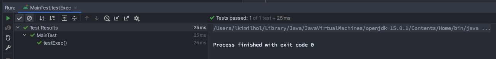
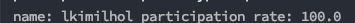
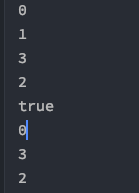

# week 04. 제어문

### 4-1. 선택문

선택문의 종류는 if, switch문이 있다.  
if문을 먼저 살펴보도록 하자.

if문은 문자대로 만약에~ 라는 의미를 가지고 있다.  
코드를 보면 쉽게 이해가 될 것이다.

```
int a = 3;
if (a > 2) {
    System.out.println("true"); //a는 2보다 크기에 true가 출력된다.
}
```

그렇다면 a > 2 조건이 참이 아니라면 어떻게 될까?  
else 문을 추가하여 보자.

```
int a = 1;
if (a > 2) {
    System.out.println("true");
} else {
    System.out.println("false"); //a는 2보다 작기에 false가 출력된다.
}
```

if의 조건을 여러개로 사용 가능하다. 바로 else if를 사용하면된다. 마찬가지로 예제를 보도록 하자.

```
int a = 4;
if (a > 5) {
    System.out.println("true");
} else if (a > 3) {
    System.out.println("else if"); //a > 3 의 조건을 만족시키기 때문에 else if가 출력
}
else {
    System.out.println("false");
}
```
else if가 출력 되는 것을 확인 할 수 있다.
</br>
</br>
</br>
</br>
 
선택문의 다른 하나는 switch 이다. 다음 예제를 통해 알아보도록 하자.  

```
int a = 3;
switch(a) {
    case 1:
        System.out.println(1);
    case 2:
        System.out.println(2);
    case 3:
        System.out.println(3);
    case 4:
        System.out.println(4);
    case 5:
        System.out.println(5);
```

위의 코드에서 출력 결과는 어떻게 될까? 바로  
3  
4  
5  
가 출력이 된다.

switch문의 case 3: 을 보도록 하자.
a의 값을 조건으로 걸어 두었고 (switch(a)) a가 3 이기 때문에 3부터 출력을 시작하였다. case는 a의 값이 1일 때는 case 1:이 실행되고 2일때는 case 2:가 실행된다.  
case문의 3에 조건이 걸렸기 때문에 case 3: 의 구문을 실행하게 되었고, 그 아래에 있는 case 들이 실행 되었다.  
이처럼 case문의 조건이 참이라면 아래의 case들이 모두 실행이 된다.  
case문의 3만 출력을 하게 하려면 어떻게 해야할까?

```
int a = 10;
switch(a) {
    case 1:
        System.out.println(1);
    case 2:
        System.out.println(2);
    case 3:
        System.out.println(3);
        break;
    case 4:
        System.out.println(4);
    case 5:
        System.out.println(5);
}
```

break; 문을 넣으므로써 출력이 3만 되는 것을 확인 할 수 있다.  
그럼 a의 값을 한번 10으로 넣어보도록 하자. 결과는 어떻게 될까?  
결과는 아무것도 출력되지 않는다. case문의 조건에 맞는것이 없기 때문이다. 그럼 조건이 아무것도 없을 경우의 처리를 추가 할 순 없을까?  
default 문을 추가하여 보자.

```
int a = 10;
switch(a) {
    case 1:
        System.out.println(1);
    case 2:
        System.out.println(2);
    case 3:
        System.out.println(3);
        break;
    case 4:
        System.out.println(4);
    case 5:
        System.out.println(5);
    default:
        System.out.println(a); //10이 출력이 된다.
}
```

default는 case 조건에 모두 해당되지 않을 경우에 실행되는 것으로 생각하면 편하다.
switch문은 자바 버전에 따라 새로운 문법들이 가능하다. 다음은 다른 코드의 switch 문을 확인하여 보자.

```
int a = 3;
switch(a) {
    case 1 ->
        System.out.println(1);
    case 2 ->
        System.out.println(2);
    case 3 ->
        System.out.println(3);
    case 4 ->
        System.out.println(4);
    case 5 ->
        System.out.println(5);
    default ->
        System.out.println(a);
}
```

위의 swich 문의 결과는 어떻게될까? 결과는 바로 3이다. 추가로 4, 5도 출력되지 않는다.

추가로 자바 13에서는 yield 키워드가 추가 되었다. yield는 switch 안에서의 return 이라고 생각 하면 쉽다. 예제를 살펴보도록 하자.

```
int a = 3;
int b = switch(a) {
    case 1 :
        yield 1;
    case 2 :
        yield 2;
    case 3 :
        yield 3;
    case 4 :
        yield 4;
    case 5 :
        yield 5;
    default :
        yield -1;
}
```

b의 값으로는 case 3: yield 3 코드가 실행되어 b의 값은 3이 된다.


### 4-2. 반복문

반복문에는 for 문 그리고 while 문이 있다. 차근히 살펴 보도록 하자.

```
for (int i = 0; i < 10; i++) {
    System.out.println(i);
}
```

위의 코드에서 출력의 결과는 어떻게 될까?  
0  
1  
2  
3    
.  
.  


해당 코드는 0부터 9까지 출력을 해준다. 그럼 해당코드를 분석하여 보자.

일단 for 문의 int i는 int형 변수 i를 선언한 것이다. 초기값을 주었다고 생각하면 된다. 그리고 나서 2번째 i < 10의 조건 부분을 보게 된다.  
i는 0이고 (초기값이므로) 10보다 작으므로 해당 조건은 참이다. 그러면 스코프 안의 내용을 실행한다. 그리고 나서 마지막 단계인 i++ 을 실행하게 된다.

그럼 i는 1이 되고 조건 검사는 그대로 i < 10 조건을 만족하기 때문에 스코프 영역을 계속 실행하게 된다. 이 실행은 i가 10이되어 조건을 만족하지 못할 때 까지 반복이 된다.
즉 0~9까지 10번이 실행되는 것이다.


다음은 while문을 봐보도록 하자.

```
int i = 0;
while (i < 10) {
    System.out.println(i);
    i++;
}
```

for문과 같은 결과는 출력하는 while 문이다. while 문은 조건이 while (조건식) 구조로 되어 있으며 해당 조건은 만족할시 계속해서 반복을 하는 반복문이다.  
반복문을 탈출 시킬 수 있기 위해 조건을 변경하는 부분을 꼭 넣도록 하자.

그렇다면 do while문은 어떤 반복문일까?

```
int i = 0;
do {
    System.out.println(i);
    i++;
} while (i < 0) ;
```

일단 i의 값은 0으로 초기화 하였다. 그리고 while 문의 조건식에 보면 i < 0 보다 작으면 이라는 조건을 걸어두었다.
do while문 에서는 do내용은 무조건 실행이 된다.

즉 0이 제일 처음 출력이 되고 i++가 되어 i는 1이 된다. 그리고 나서 while 반복문의 조건을 확인한다.  
i < 0 보다 작지 않으므로 해당 반복문은 종료가 된다.

이처럼 do while문의 경우 1번은 무조건 실행이 되는 부분이 while 반복문과 차이가 있다. while 반복문의 경우 초기값을 0으로 주고 while (i < 0) 의 조건을 만나게 된다면 이미 0은 0보다 작지 않기 때문에 반복문을 실행하지 않게 된다.


### 4-3. 과제 0. JUnit 5 학습하세요.

사용하고 있던 ide가 intellij이기 때문에 추가한 방법을 설명하려고 한다.

일단 test폴더를 만들어 줬다. 경로는 프로젝트 제일 top 이었다. 폴더를 만들고 프로젝트의 Open Module Setting을 통하여 test 폴더를 테스트 폴더로 지정을 해주자.
그럼 이렇게 폴더의 색깔이 녹색으로 변한다.

  

이후 패키지를 생성하고(나는 소스 폴더의 경로 그대로 만들어 주었다) 테스트 케이스 작성을 해보자.

```
@Test
public void testExec() {
    int i = 1;
    Assertions.assertEquals(1, i);
}
```

테스트 실행 후 동작이 잘 되는 것을 확인 할 수 있다.




### 4-4. 과제 1. live-study 대시 보드를 만드는 코드를 작성하세요.

```
 public void calculateParticipation() throws IOException {
        GitHub github = new GitHubBuilder().withPassword("lkimilhol", "xxxx").build();
        GHRepository ghRepository = github.getRepository("lkimilhol/whiteship");
        List<GHIssue> issueList = ghRepository.getIssues(GHIssueState.ALL);

        Map<String, Integer> userCount = new HashMap<>();

        for (GHIssue issue : issueList) {
            List<GHIssueComment> comments = issue.getComments();
            for (GHIssueComment comment : comments) {
                GHUser user = comment.getUser();
                String name = user.getName();

                if (userCount.containsKey(name)) {
                    int cnt = userCount.get(name);
                    userCount.put(name, ++cnt);
                } else {
                    userCount.put(name, 1);
                }
            }
        }

        userCount.forEach((k, v) -> {
            double rate = Math.round(((double) v / issueList.size()) * 100) / 100.0;
            System.out.println("name: " + k + " " + "participation rate: " + rate * 100);
        });
    }
```

간단하게 설명하자면 gitHub API를 참고 하였으며 issue는 레퍼지토리 내에 새로 생성하여 테스트 해보 았다. 테스트 결과는 내가 댓글을 달아놓은 이슈의 코멘트 수 만큼 제대로 카운팅이 되는것을 확인하였다.



### 4-5. 과제 2. LinkedList를 구현하세요.

https://github.com/lkimilhol/whiteship/blob/master/src/main/java/dataStructure/ListNode.java

```
    ListNode head = new ListNode();
    head.setData(0);

    ListNode listNode1 = new ListNode();
    listNode1.setData(1);

    ListNode listNode2 = new ListNode();
    listNode2.setData(2);

    ListNode listNode3 = new ListNode();
    listNode3.setData(3);

    head.add(head, listNode1, 1);
    head.add(head, listNode2, 2);
    head.add(head, listNode3, 2);
    head.printList(head);
    head.remove(head, 1);
    System.out.println(head.contains(head, listNode3));
    head.printList(head);
```

head를 기준으로 add가 되는 LinkedList를 구현하였다.

add 쪽 for loop가 조금 헷갈릴 수 있는데, 결국 마지막의 노드까지 가보고 null 일 경우에는 마지막 노드에서 추가를 해주게 되는것이고,  
그렇지 않다면 position - 1 에서 넣어 주어야 할 자리의 노드를 구하는 것을 알 수 있다.

그리고 나서 그 노드의 next를 임시 노드에 담은뒤 연결을 해준다고 생각하면 된다.

중간에 remove 그리고 contains가 잘 구현되는것을 확인 해볼 수 있다.

