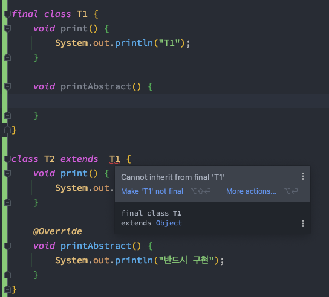

# week 06. 상속

### 6-1. 자바 상속의 특징

객체지향에서의 상속이란   
부모 클래스에서 정의된 필드와 메소드를 자식 클래스가 물려받는 것이다.

그럼 객체지향에서 상속이 왜 필요할까?

- 공통된 특징을 가지는 클래스 사이의 멤버(필드, 메소드) 선언이 불필요하다.
- 부모 클래스의 멤버(필드, 메소드)를 재사용함으로써 자식 클래스가 간결해진다.
- 클래스간 계층적 분류 및 관리가 쉬워진다.

자바 상속의 특징은 과연 무엇일까?

자바 상속의 특징으로는 3가지 정도가 있다.

- 자바에서는 다중상속을 지원하지 않는다. 따라서 extends 뒤에는 단 하나의 부모 클래스만 올 수 있다.
- 자바에서는 상속의 횟수에 제한을 두지 않는다.
- 자바의 최상위 클래스는 Ojbect이다.


### 6-2. super 키워드

위의 상속에서 부모 클래스와 자식클래스의 내용을 보았다. 부모 클래스는 상속을 하는 클래스, 자식 클래스는 상속을 받는 클래스이다.

또한 부모클래스를 슈퍼클래스라고 부르기도 하며 super 키워드는 이와 관련되어있다.

자바에서 super 키워드는 부모 클래스의 객체를 즉시 참조할때 사용하게 된다. 다음은 super 키워드를 사용하는 방식에 대한 설명이다.

- 부모클래스의 인스턴스 변수, 메소드를 즉시 참조할 때 사용 된다.
- super()는 부모클래스의 생성자를 호출 할 때 사용 된다.

부모클래스와 자식클래스의 공통 된 변수명을 사용 할 경우 this 키워드와 같이 super 키워드를 사용 함으로써 어떤 클래스의 멤버변수에 접근 하는지 쉽게 파악이 가능하다.

또한 this 키워드와 마찬가지로 클래스 메소드에는 사용 할 수 없다.

부모클래스의 생성자를 호출 할 때 사용되는 super()의 경우에 부모클래스의 생성자의 구현을 파악해줘야한다. 파라메터로 넘기는 값이 필요한데 넘기지 않을 경우는 컴파일 에러를 만나게 된다.

```

class Person {
int age;
String name;
    public int getPlusAge(int age) {
        return this.age + age;
    }
}

```

만약 위의 클래스를 상속받는 클래스가 하나 있다고 가정하자. 이 때 super()를 사용하게 되면 컴파일 에러를 만나게된다.
super(10) 처럼 age 아규먼트를 넘겨줘야 에러가 발생하지 않는다.


### 6-3. 다이나믹 메소드 디스패치 (Dynamic Method Dispatch)

Dynamic method dispatch
dynamic은 runtime의 동의어로 사용되며, dispatch는 어떤 메소드를 호출할지 결정하는 것이다. 

즉 컴파일 시점에선 어떤 메소드를 호출하는지 모르게 되며 런타임 시점에서 할당 된 객체의 타입을 보고 메소드를 실행하는 것이다.  
추상 타입의 메소드를 호출하는것만 알고 있음.

다음의 예제를 살펴보자.

```
public class Main {
    public static void main(String[] args) {
        T1 t = new T1();
        t.print();

        t = new T2();
        t.print();

        t = new T3();
        t.print();
    }
}

class T1 {
    void print() {
        System.out.println("T1");
    }
}

class T2 extends  T1 {
    void print() {
        System.out.println("T2");
    }
}

class T3 extends  T1 {
    void print() {
        System.out.println("T3");
    }
}
```


메인 메소드를 실행 한 결과 위와 같은 결과가 출력되었다. 즉 런타임에 새로 메모리에 할당 된 클래스의 메소드가 호출 된 것을 확인 할 수 있다.

### 6-4. 추상 클래스

추상 클래스는 class 선언 시 class 앞에 abstract 라는 키워드가 들어간 클래스를 말한다.   
또한 **하나 이상의 추상 메소드(abstract method)를 포함하는 클래스** 이다.

그렇다면 이 추상 클래스의 역할은 어떻게 될까?

이 추상클래스에서 가지고 있는 추상 메소드는 반드시 자식 클래스에서 상속받아 구현해야 하며 이는 클래스의 확장성에 의미를 둔다.
또한 추상 클래스는 인스턴스화 할 수 없다. 


위의 이미지에서 볼 수 있듯이 T1은 abstract 키워드를 붙여서 생성 된 추상클래스 이므로 인스턴스화가 불가능하다.
다음 예제를 보도록 하자.

```
public class Main {
    public static void main(String[] args) {
        T2 t = new T2();
        t.printAbstract();
    }
}

abstract class T1 {
    void print() {
        System.out.println("T1");
    }

    abstract void printAbstract();
}

class T2 extends  T1 {
    void print() {
        System.out.println("T2");
    }

    @Override
    void printAbstract() {
        System.out.println("반드시 구현");
    }
}
```

아래 T2 클래스에서 @Override 키워드를 잘 보도록 하자. T1 클래스에서 선언 되어 있는 추상메소드와 동일한 이름의 메소드로 구현이 되어있다.

이처럼 추상메소드는 미완성된 설계도로 비유되기도 하며 이는 자식클래스에서 상속받아 구현을 해줘야 한다.

또한 부모클래서에서 abstract 키워드로 지정 되어 있는 추상메소드를 자식클래스에서 구현을 한 것이며 이는 자식클래스에서 부모클래스를 상속받아 확장한 것이다.
이처럼 추상클래스는 자식클래스에서 상속을 받은 뒤 클래스를 확장하는 개념을 포함하고 있다.

추상 메소드의 접근 지정자로 private는 사용할 수 없는데 이는 자식 클래스에서 받아서 구현되어야 하기 때문이다.

### 6-5. final 키워드

자바에서 final 키워드는 상수에도 사용되기도 하며 클래스에서 상속을 불가하도록 하기도 한다.  
즉 변수 앞의 final 키워드는 상수로서 값이 변할 수 없음을 기억해야 한다.


위의 이미지를 확인 해 보면 IDE에서 final로 선언 된 a의 값을 바꿀 수 없다고 해주고 있다.
이처럼 컴파일 타임에서 final 키워드가 붙은 변수는 값을 바꿀 수 없는 것이다.

클래스에서 선언된 멤버 변수에 final 키워드가 붙는다면 이는 오버라이딩이 불가하다는 의미이며, class 앞의 final 키워드는 상속이 불가능하다.



또한 final 키워드는 참조변수에도 적용이 가능한데 이 경우에 참조 변수가 힙 영역 내의 다른 메모리를 참조할 수 없다는 것을 의미한다.


### 6-7. Object 클래스

java.lang.Object 클래스는 모든 클래스와 사용자가 정의한 모든 클래스의 최상위 클래스로써 모든 클래스는 Object 클래스로부터 상속받게 된다. 

사용자가 클래스를 정의할 때 클래스 선언부에 명시적으로 extends java.lang.Object를 지정하지 않아도 자동으로 상속받게 된다. 

즉 Object 클래스의 모든 메서드와 변수는 다른 모든 클래스에서도 사용 가능할 수 있다는 말이다.
다음은 Object 클래스의 주요 메소드들이다.


