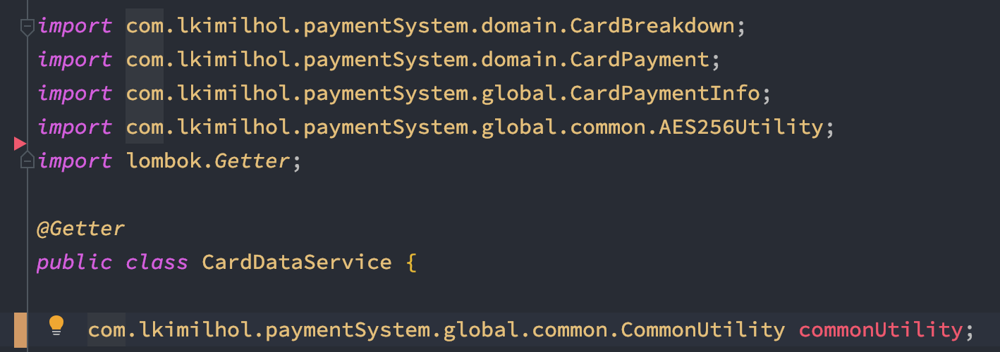

# week 07. 패키지

### 7-1. package 키워드

패키지란 폴더의 개념과 크게 다르지 않다. 우리가 폴더에서 비슷한 파일들을 정리 해 놓는 것과 마찬가지로 패키지 또한 비슷한 역할을 하는 java 파일들을 모아놓게 된다.
따라서 우리는 패키지 안에 관련 된 클래스 혹은 인터페이스들을 하나로 묶어 두게 된다.

다음은 패키지의 선언 방법이다.

```
package 패키지 이름/패키지 경로; 
```

**디렉토리가 하위 디렉토리를 가질 수 있는 것처럼, 패키지도 다른 패키지를 포함할 수 있으며 점 '.' 으로 구분한다.**

이렇게 java 파일 제일 처음에 패키지를 명시해두면 해당 java 파일에 있는 클래스와 인터페이스는 해당 패키지에 포함되게 된다.

패키지는 접근지시자와 관련이 있다. 접근 지시자는 추후 다룰 예정인데, 접근 지시자에 따라 같인 패키지라면 접근이 되거나 상속이 가능한 등의 캡슐화가 가능하다.


### 7-2. import 키워드

import는 클래스를 분리시켜 놓은 뒤 다른 패키지에 있는 클래스에 접근하기 위한 키워드이다.  
즉 서로 관련 된 클래스나 인터페이스끼리 묶어 놓은 패키지별로 다른 패키지 안의 클래스에 접근하기 위해서는 import 키워드가 필수이다.

즉 **import문은 컴파일러에게 소스파일에 사용된 클래스의 패키지에 대한 정보를 제공하는 것이다.**

컴파일 시에 컴파일러는 import문을 통해 소스파일에 사용된 클래스들의 패키지를 알아 낸 다음, 모든 클래스 이름 앞에 패키지명을 붙여 준다.  
하지만 코드를 작성하기 전 import 문으로 포함 된 패키지들은 클래스 앞의 패키지 명이 생략이 가능하다.



commonUtility 앞에 패키지 명이 적혀있지만


import 후에는 패키지명이 생략되어 있다.


### 7-3. 클래스패스

클래스패스란 클래스를 찾기 위한 경로이다. 즉 JVM이 실행 될 때 실행한 클래스들에 대한 경로는 안내하는 것이다.  
JVM에서 .java 파일안의 클래스들을 .class 파일로 변환을 시키고 이 .class 파일을 실행시키기 위한 경로를 찾게 해준다고 생각하면 된다.

자바에서는 환경변수에서 클래스패스를 설정하거나(CLASSPATH로 등록한다) 자바 런타임에 -classpath 옵션을 주는 것이다.


### 7-4. CLASSPATH 환경변수

환경변수란 OS에서 어떠한 응용프로그램이 동작 되도록 하는 설정 값이라고 생각하면 된다.  
이 환경변수를 등록 함으로써 우리가 자주 사용 하는 프로그램들이 어떠한 장소에서도 실행이 가능하도록 해준다.

다음은 환경변수 설정을 확인해보자.


일단 자바를 실행 시키기 위한 JAVA_HOME 클래스패스는 jdk경로에서 bin폴더를 넣어주면 되는데, JAVA_HOME 이란 다른 프로그램이 JDK, JRE를 사용할 수 있도록 구성한 폴더라고 이해할 수 있다.

또한 환경 변수에 CLASSPATH를 등록시켜야 하는데 CLASSPATH란   

JVM이 시작될 때 JVM의 클래스 로더는 이 환경 변수를 호출한다. 
그래서 환경 변수에 설정되어 있는 디렉토리가 호출되면 그 디렉토리에 있는 클래스들을 먼저 JVM에 로드한다. 
그러므로 CLASSPATH 환경 변수에는 필 클래스들이 위치한 디렉토리를 등록하도록 한다.

CLASSPATH의 변수 값은 자신의 컴퓨터에 설치된 %JAVA_HOME%\lib를 입력하면 된다.


### 7-5. -classpath 옵션


```
java -classpath ".:lib" xxx
```
. (현재디렉토리) :(아래에있는 windows는 ; 을 사용해야함) lib(폴더) 를 클래스패스로 지정하고  
xxx 라는 클래스를 실행한 명령어이다.

만약 .class 파일들이 다른 폴더에 있다면 꼭 클래스패스를 지정해주어 JVM이 이를 찾아 갈 수 있도록 해야 한다.


### 7-5. 접근지시자

자바의 접근지시자란 패키지에서 접근이 가능한 범위를 설정하는 키워드이다.


private < default < protected < public 으로써 제한의 범위가 점점 넓어진다.


접근 지시자는 class 나 메소드, 변수 앞에 선언이 가능하며 이 키워드에 맞게 범위를 가지게 된다.

만약 접근 지시자 범위 밖에 행동(다른 패키지에서 default 클래스를 접근하려고 하면) 컴파일 에러가 발생하게 된다.

```
public class A {
    /*
     * A 클래스가 public으로 선언되어 있기 때문에
     * 다른 클래스에서 접근이 가능
     */
}

class B {
    A a;

    public void someMethod() {
        A = new a();
    }
}
```


```
package p1;
public class A {
    /*
     * 같은 패키지에 있어서 접근 가능
     */
}

class B {
    A a;

    public void someMethod() {
        A = new a();
    }
}


//********************//
package p2;

class C {
    // 다른 패키지에 있어서 접근 불가능
    A a;
}
```


```
package p1;
public class A {
     protected void sayHello() {
        System.out.println("Hello");
    }
}

class B {
    A a;

    public void someMethod() {
        A = new a();
    }
}


//********************//
package p2;

class C extends A {
    A a = new A();
    a.sayHello(); //Hello 출력
}
```


private, protected 같은 경우 Inner class로 접근지시자를 사용 할 수 있다.