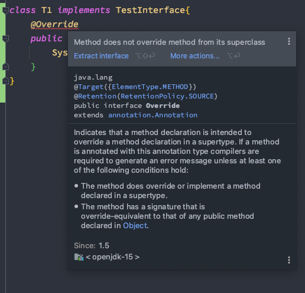

# week 08. 인터페이스

### 8-1. 인터페이스 정의하는 방법

인터페이스는 class 키워 대신 interface 키워드를 사용하여 정의한다.

```
interface a {
}
```

클래스에서는 생성자가 있거나, 변수 메소드 등을 가지고 있지만 인터페이스에서는 상수와 메소드만을 가지게 된다.

- 인터페이스는 추상 메서드와 상수만 멤버로 가질 수 있다.
- 일반 메서드와 멤버 변수는 구성원으로 가질 수 없다.
- 모든 멤버 변수는 public static final이어야 하며, 이를 생략할 수 있다.
- 모든 메서드는 public abstract이어야 하며, 이를 생략할 수 있다.
- 자바8 부터는 인터페이스에 default 메소드를 사용 가능하다.

```
interface a {
    int a = 1; //자동으로 public static final 키워드가 붙게 된다.
    void print(); // 자동으로 pulbic abstract 키워드가 붙게 된다. 
    //{} 메소드의 구현부가 있으면 컴파일 에러이다.
}
```

### 8-2. 인터페이스 구현하는 방법

인터페이스는 extends 키워드가 아닌 implements 키워드를 이용하게 된다.  
인터페이스로 선언 되어 있는 메소드들은 전부 클래스에서 구현을 해줘야 한다.

아래 예제를 보도록 하자.

```
public interface TestInterface {
    int a = 1 ;
    void print();
}
```

```

public class Main {
    public static void main(String[] args) {
    }

}

class T1 implements TestInterface{

    @Override
    public void print() {
        System.out.println("구현해줘야한다");
    }
}

```

아래 T1 클래스는 TestInterface를 구현하게 되어 @Override 애노테이션이 있는 메서드를 구현해주게 된다. (구현하지 않으면 컴파일 에러)

이처럼 인터페이스에 명시 된 메소드들은 반드시 구현을 해 줘야 하며 강제로 구현해야 하는 메소드가 정의되어 구현의 강제, 즉 규격화가 이뤄지게 된다.
또한 각 클래스 마다 구현부를 다르게 구현 할 수 있으니 다형성의 장점까지 얻게 된다.

### 8-3. 인터페이스 레퍼런스를 통해 구현체를 사용하는 방법

Main 클래스에서 인터페이스 참조변수를 생성하고 구현체를 구현해보도록 하자.

```
public class Main {
    public static void main(String[] args) {
        TestInterface t = new TestInterface() {
            @Override
            public void print() {
                
            }
        };
    }
}
```

위와 같이 구현이 된다면 어떤 이점이 있을까? 바로 일회성이다.

만약 인터페이스를 일회성으로 사용 할 경우 위와 같은 방법으로 익명 구현 객체를 통하여 구현하도록 하자.


### 8-4. 인터페이스 상속

자바에서 클래스는 다중 상속이 불가능하다. 하지만 인터페이스는 다중 상속이 가능하다.

```
public interface TestInterface {
    int a = 1 ;
    void print();
}

interface TestInterface2 {
    void print();
}

interface TestInterface3 extends TestInterface, TestInterface2 {
    void print();
}
```

### 8-5. 인터페이스의 기본 메소드 (Default Method), 자바 8

인터페이스가 내에 default 키워드가 붙은 메소드들은 인터페이스 내에서 구현이 가능하다.
또한 이 인터페이스를 구현하는 클래스에서는 이를 오버라이딩(재정의) 할 수 있다.

```
public interface TestInterface {
    int a = 1 ;
    default void print() {
        System.out.println("구현!");
    }
}
```
```
class T1 implements TestInterface{
    @Override
    public void print() {
        System.out.println("구현2");
    }
}
```

위의 예제에서 default로 선언 된 print() 메소드가 구현되어 있는 것을 볼 수 있다.

interface를 상속 받은 뒤로 default 메소드의 수정이 필요 할 때 상속받고 있던 인터페이스에서 굳이 상속을 한 인터페이스의 메소드를 수정 할 것 없이 바로 상속받아 오버라이딩이 가능하다.


### 8-6. 인터페이스의 static 메소드, 자바 8

static 메소드는 오버라이드 하여 재정의가 불가능하다.
예제를 다음과 같이 바꿔 보도록 하자.

```
public interface TestInterface {
    int a = 1 ;
    static void print() {
        System.out.println("구현!");
    }
}
```



이후 오버라이딩 하려고 하면 이처럼 컴파일 에러가 발생한다.

또한 이 메소드는 반드시 클래스 명으로 호출 해야 한다.
다음 예제를 확인해보자.

```
public class Main {
    public static void main(String[] args) {
        TestInterface.print(); // 구현!
    }
}
```

위에 정의된 인터페이스에 나와 있듯이 구현! 이 출력 되게 된다.
디폴트 메소드와는 달리 참조변수의 구현 없이도 호출이 가능하다.


### 8-7. 인터페이스의 private 메소드, 자바 9

private 메서드는 자바 인터페이스 안에서만 사용 되는 메소드이다.
이는 구현 클래스와 인터페이스의 상속 또한 불가능 하다.

private 메서드는 private, abstract, default, static 메서드를 호출 할 수 있다.
private static은 static, private static을 호출 할 수 있다.  
(static 메소드에서도 private static이 호출 가능)


```
public interface TestInterface {
    int a = 1 ;
    default void print() {
        privatePrint();
        staticPrint();
        privateStaticPrint(); //호출 가능 범위 확
    }

    private void privatePrint() {
        System.out.println("내부구현!");
    }

    static void staticPrint() {
        privateStaticPrint();
    }
    
    private static void privateStaticPrint() {
        System.out.println("private 구현");
    }
}
```