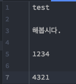
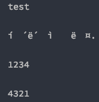
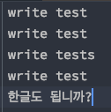
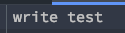
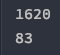
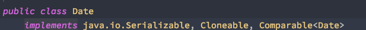
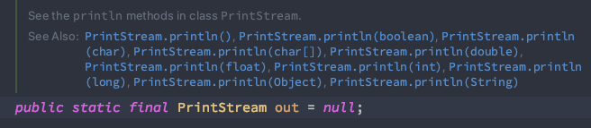

# week 13. I/O

### 13-1. 스트림 (Stream) / 버퍼 (Buffer) / 채널 (Channel) 기반의 I/O

일단 I/O란 무엇을 뜻하는 것일까?

I/O란 input, output을 뜻하는 것으로 입출력이라고 표기한다.

그렇다면 java 에서의 I/O란 어떤것을 뜻하는 것일까?

java에서 스트림이나 버퍼 등의 개념을 이용하여 I/O를 동작하게 하는 것으로 스트림, 버퍼, 채널 모두 I/O의 종류이며 각기 다른 방식으로 I/O를 지원하게 된다.


java 에서의 java.io 패키지 내용을 한번 확인해 보도록 하자.

>* Package java.io
Provides for system input and output through data streams, serialization and the file system. Unless otherwise noted, passing a null argument to a constructor or method in any class or interface in this package will cause a NullPointerException to be thrown.
>*  패키지 java.io 데이터 스트림, 직렬화 및 파일 시스템을 통한 시스템 입력 및 출력을 제공합니다. 달리 명시되지 않는 한,이 패키지의 모든 클래스 또는 인터페이스의 생성자 또는 메서드에 null 인수를 전달하면 NullPointerException이 throw됩니다.

자바에서 io 패키지에서는 입출력을 제공해주며 패키지의 모든 클래스의 생성자와 메서드에는 null을 전달하면 안된다고 쓰여 있다. 일단 자바에서의 입출력을 제공하는 패키지임을 기억하자.

이제 스트림/ 버퍼/ 채널의 I/O를 알아보도록 하자.


<스트림>

스트림이란 한쪽에서 다른 한 쪽으로 데이터를 전송하는 연결 통로이다. 스트림은 데이터의 흐름을 물과 비유하여 생긴 명칭인데, 물이 높한쪽으로 흐르듯 스트림 또한 한쪽 방향으로의 데이터 전송이 가능하다. 
즉 입력과 출력을 위해서는 스트림이 2개가 필요하다. 

또한 **자바8에서 추가 된 스트림과는 다른 의미** 이니 기억 하도록 하자.

스트림은 문자 단위 처리인 **문자 스트림**과 바이트 단위 처리인 **바이트 스트림**이 있다.

예제를 통해 텍스트 파일 내용을 읽어 보도록 하자. java 레퍼런스를 체크해보니 다음과 같은 내용이 있었다. 우리는 FileReader와 FileInputStream 모두 예제로 실습 해 보도록 하자.

>FileReader is meant for reading streams of characters. For reading streams of raw bytes, consider using a FileInputStream.

다음은 test.txt 라는 파일을 생성하고(프로젝트 경로에 만들어 주면 된다) 파일의 내용을 읽는 예제이다.



문자 스트림 FileReader를 사용한 예제이다.

```
public class Main {
    public static void main(String[] args) {
        try (FileReader fileReader = new FileReader("test.txt")) {
            int charsRead = 0;
            while ((charsRead = fileReader.read()) > -1) {
                System.out.print((char) charsRead);
            }
        } catch (IOException e) {
            e.printStackTrace();
        }
    }
}
```

fileReader.read() > -1 의 의미는 파일의 끝에 도달하지 않았다는 뜻이다. 파일에 끝에 도달하면 -1을 만나기 때문이다.

while 문을 반복하면서 charsRead라는 값을 읽어서 character 형으로 출력을 해주고 있다. charsRead를 character 형을로 변환하지 않는다면 ASCII 값을 10진수로 표현한 값들을 볼 수 있다.

 

FileReader는 문자 한글자를 만나서 출력하는 내용으로 이해하면 쉽다.


다음은 바이트 스트림인 FileInputStream이다.


```
public class Main {
    public static void main(String[] args) {
        try (FileInputStream fileInputStream = new FileInputStream("test.txt")) {
            int data = 0;
            while((data = fileInputStream.read()) > -1) {
                System.out.print((char)data);
            }
        } catch (IOException e) {
            e.printStackTrace();
        }
    }
}
```



인코딩을 형식을 지정하여 스트림을 읽어 올 수 있는데, 해당 방법을 사용하려면 아래와 같이 해야한다. 

```
 public static void main(String[] args) {
        try (FileInputStream fileInputStream = new FileInputStream("test.txt")) {
            InputStreamReader inputStreamReader = new InputStreamReader(fileInputStream, "UTF-8");
            BufferedReader bufferedReader = new BufferedReader(inputStreamReader);
            int data = 0;
            while((data = bufferedReader.read()) > -1) {
                System.out.print((char)data);
            }
        } catch (IOException e) {
            e.printStackTrace();
        }
    }
```

BufferReader 클래스와 InputStreamReader 클래스를 사용하였다. 해당 클래스를 사용하지 않는 방법도 있다. 

```
public class Main {
    public static void main(String[] args) {
        try (FileInputStream fileInputStream = new FileInputStream("test.txt")) {
            byte[] b = new byte[1024];
            fileInputStream.read(b);
            System.out.println(new String(b));
        } catch (IOException e) {
            e.printStackTrace();
        }
    }
}
```

결과를 확인 해 보자.


끝에 이상한 문자가 들어 간 것을 알 수 있다. 아무래도 byte b를 선언 할 때 사이즈를 1024로 주어서가 아닐까?  
그렇다면 byte b를 선언 할 때 예제로 만들어 놓은 test.txt 파일의 사이즈만큼 넣어 보도록 하자.

```
 byte[] b = new byte[fileInputStream.available()];
```


끝에 이상한 문자가 들어가지 않는것을 확인 해 볼 수 있다.

그렇지만 해당 방법은 조금 이상한 부분이있다. 파일의 사이즈를 고려하여 한번에 파일 내의 문자를 byte 배열에 담아 byte를 String으로 출력하는 방법인데, 파일의 크기가 엄청나게 크다면 어떻게 될까? 문자를 읽는 방법 또한 깔끔하지 않는 기분까지 든다.

때문에 위의 레퍼런스에 나와 있듯이 문자열의 스트림을 읽을 땐 FileReader, 원시 byte 스트림을 얻어야 한다면 FileInputStream을 사용하도록 하자. 

다음은 스트림을 활용한 출력이다.

```
public class Main {
    public static void main(String[] args) {
        try (FileWriter fileWriter = new FileWriter("test.txt", true)) {
            String s = "\n한글도 됩니까?";
            fileWriter.write(s);
        } catch (IOException e) {
            e.printStackTrace();
        }
    }
}
```

FileWriter를 활용하였다. 한글까지 잘 남겨지는지 테스트 하기 위해 한글도 테스트를 해 보았다.



한글까지 잘 남겨져 있는 것을 확인 할 수 있다.

다음은 FileOutStream의 예제이다.

```
public class Main {
    public static void main(String[] args) {
        try (FileOutputStream fileOutputStream = new FileOutputStream("test.txt")) {
            String s = "write test";
            fileOutputStream.write(s.getBytes(StandardCharsets.UTF_8));
        } catch (IOException e) {
            e.printStackTrace();
        }
    }
}
```

그리고 test.txt 파일을 확인 해 보자.



파일 내용이 모두 제거 되고 write test라는 내용이 들어가 있는 것을 확인 할 수 있다.

해당 파일에 내용을 붙여 쓰려면 어떻게 해야 할까?

```
FileOutputStream fileOutputStream = new FileOutputStream("test.txt", true)
```

마지막에 true를 매개변수로 넘겨주고 있는데 true 시 파일이 append 되도록 한 것이다. (FileWriter 또한 마찬가지의 매개변수가 있다)


<버퍼> 

버퍼를 사용하면 FileWriter를 이용하는 것 보다 효율적인데, 이유는 버퍼에 데이터를 쌓아놓고 한번에 쓰기가 가능하기 때문이다.
또한 버퍼를 사용하면 효율이 비교불가 급으로 높아진다고 한다.

버퍼의 쓰기를 한번 테스트 해 보도록 하자.

```
public class Main {
    public static void main(String[] args) {
        try (FileOutputStream fileOutputStream = new FileOutputStream("test.txt");
             BufferedWriter bufferedWriter = new BufferedWriter(new FileWriter("test1.txt", true));) {
            String s = "\n한글도 됩니까?";

            long start = System.currentTimeMillis();

            for(int i = 0; i < 1000000; i++)
                fileOutputStream.write(s.getBytes(StandardCharsets.UTF_8));

            long end = System.currentTimeMillis();
            System.out.println(end - start);

            start = System.currentTimeMillis();

            for(int i = 0; i < 1000000; i++)
                bufferedWriter.write(s);

            end = System.currentTimeMillis();
            System.out.println(end - start);


        } catch (IOException e) {
            e.printStackTrace();
        }
    }
}
```



1000000번 파일의 쓰기를 테스트 했을때 BufferedWriter가 월등히 빠른 것을 알 수 있다. output의 연산이 많을 수록 두 방식의 차이는 더욱 크게 날 것이다.

다음은 버퍼의 읽기이다.

```
public class Main {
    public static void main(String[] args) {
        try (BufferedReader bufferedReader = new BufferedReader(new FileReader("test.txt"))) {
            while(bufferedReader.readLine() != null)
                System.out.println(bufferedReader.readLine());
        } catch (IOException e) {
            e.printStackTrace();
        }
    }
}
```
위의 예제는 bufferedReader를 활용한 파일 읽기이다. 파일 읽기는 라인 단위로 가능하며 빈 라인은 출력되지 않는다.


<채널>

채널은 IO 중에서 NIO (New Input Output) 패키지 속하는데 jdk 1.3 부터 생긴 패키지이며 자바의 IO의 속도 향상을 낼 수 있다.

NIO는 채널 기반의 패키지 인데 채널은 스트림과 달리 입출력이 동시에 가능하고 기본적으로 버퍼를 사용해 읽은 데이터를 저장하여 사용하기에 입출력의 속도가 빠르다.

이와 같은 개념으로 사용 되는 것이 셀렉터인데, 셀렉터는 여러개의 채널들 중 사용 가능한 채널을 선택하여 사용하는 것이다.
자바 NIO의 셀렉터는 하나의 스레드에서 다중 입력 채널을 관리하며 이 멀티플렉싱 메커니즘을 사용하면 단일 스레드에서 여러 채널의 입출력을 쉽게 관리할 수 있다.
(ex: 소켓 채널 관리)


### 13-2. InputStream과 OutputStream

java에서의 InputStream, OutputStream은 바이트 단위 입출력의 최상위 클래스이다.

하위 클래스로는 

>FileInputStream / FileOutputStream  
>DataInputStream / DataOutputStream  
>ObjectInputStream / ObjectOutputStream  
>BufferedInputStream / BufferedOutputStream  
>PrintStream
 
가 있다. 모든 바이트 기반의 스트림은 InputStream, OutputStream 클래스를 상속받아 구현된다.

* FileInputStream / FileOutputStream

    ```
    File file = new File("test.txt");
    input = new FileInputStream(file);
    ```
  파일로 부터 바이트로 입력받아, 바이트 단위로 출력할 수 있는 클래스
  

* DataInputStream / DataOutputStream

    데이터 입력 스트림에의해 primitive type의 Java 데이터를 읽고 쓸 수 있다.
    
    ```
    fis = new FileInputStream("StreamFile.out");
    dis = new DataInputStream(fis);
                
    /*
    boolean readBoolean() throws IOException
    byte readByte() throws IOException 
    char readChar() throws IOException 
    double readDouble throws IOException 
    float readFloat() throws IOException 
    long readLong() throws IOException 
    short readShort() throws IOException 
    int readInt() throws IOException
    */
    ```
  때문에 클래스의 메소드 또한 각 primitive type의 자료를 읽는 메소드들이 있다.


* ObjectInputStream / ObjectOutputStream  
    오브젝트의 직렬화에 대한 스트림. 각각의 생성자들도 마샬/언마샬링을 위한 생성자이다.  
    ObjectInputStream(InputStream in): in 으로부터의 언마샬링  
    ObjectOutputStream(OutputStream out): out 으로 부터 마샬링
  
    해당 클래스를 사용하기 위해서는 Object의 클래스가 serializable 인터페이스를 구현해야 한다.

    
  

* BufferedInputStream / BufferedOutputStream  
    해당 스트림은 *바이트 기반의 성능 향상 보조 스트림*이고 stream의 방식을 버퍼로 활용하여 속도 향상을 극적으로 올렸다.
    ```
    input = new BufferedInputStream(new FileInputStream("test.txt"));
    ```
  
* PrintStream
  PrintStream은 데이터를 기반스트림에 다양한 형태로 출력할수있는 메소드를 제공한다. 우리가 알고 있는 System.out 이 PrintStream 의 객체이다.

  

    또한 파일의 쓰기도 가능하다.

  ```
  public class Main {
        public static void main(String[] args) throws IOException {
            String destination = "test.txt";
    
            try(PrintStream ps = new PrintStream(destination)){
                ps.println("I love Java!");
                ps.flush();
            } catch (FileNotFoundException e) {
                e.printStackTrace();
            }
        }
    }
  ```

    