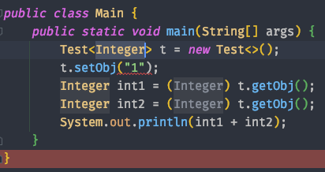
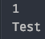
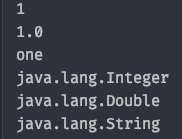
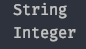

# week 14. 제네릭 

### 14-1. 제네릭 사용법

제네렉이란 무엇일까? 

자바의 제네릭이란 data type 일반화(generalize) 하는 의미로 사용이 되는데, **메소드나 클래스 내부에서 사용되는 데이터 타입을 컴파일 타임에 외부에서 지정하는 것**을 뜻한다.

만약 제네릭을 사용하지 않는다면 어떻게 될까?

자바에서 제네릭을 지원하지 않을때는 Object 타입으로 클래스를 생성하여 타입을 강제 변환시켜 사용을 하였었다. 하지만 이는 프로그램의 성능 저하로 이어 질 뿐만 아니라 타입 변환 시 자칫 잘못하면 에러를 내는 결과도 내곤 했다.

```
class Test {
    private Object obj;

    public void setObj(Object obj) {
        this.obj = obj;
    }

    public Object getObj() {
        return this.obj;
    }
}

public class Main {
    public static void main(String[] args) {
        Test t = new Test();
        Integer data = 1;
        t.setObj(data);
        Integer check = (Integer) t.getObj();
        System.out.println(check);
    }
}
```

제네릭을 사용하지 않은 예제이다. 보면 Integer check를 생성 할 때 Object 형 타입을 Integer로 캐스팅을 하는 것을 볼 수 있다.

그렇다면 이 코드는 왜 문제가 되는 것일까?

코드를 조금 수정하여 Test t가 String type을 받을 수 있도록 해보자.

```
public class Main {
    public static void main(String[] args) {
        Test t = new Test();
        t.setObj("1");
        Integer int1 = (Integer) t.getObj();
        Integer int2 = (Integer) t.getObj();

        System.out.println(int1 + int2);
    }
}
```

String type 데이터를 set해주었고 Test 클래스에서는 Object type의 데이터를 받게 되었으니 문제가 되지 않는다.

하지만 데이터를 가져온 뒤 더하기 연산을 한 결과를 출력하려고 하면 런타임에 에러가 나게 된다.


캐스팅에 대한 에러이다. 이처럼 Object type의 데이터를 형 변환 하면서 예측하지 못한 에러를 만날 수 있다.

하지만 제네릭을 사용하여 타입 변환을 강제하지 않고 컴파일 시에 타입을 정하게 되어 실행 시 에러가 나는 것을 방지 할 수 있다.

```
class Test <T> {
    private T obj;

    public void setObj(T obj) {
        this.obj = obj;
    }

    public T getObj() {
        return this.obj;
    }
}

public class Main {
    public static void main(String[] args) {
        Test<Integer> t = new Test<>();
        t.setObj("1");
        Integer int1 = (Integer) t.getObj();
        Integer int2 = (Integer) t.getObj();
        System.out.println(int1 + int2);
    }
}
```



이처럼 t.setObj("1")에서 컴파일 에러를 만날 수 있다.

아래는 제네릭을 사용한 아주 간단한 예제이다. 제네릭 타입의 클래스를 선언하고 값을 출력 한뒤 type 까지 출력한다.

```
class Test <T> {
    private T obj;

    public void setObj(T obj) {
        this.obj = obj;
    }

    public T getObj() {
        return this.obj;
    }
}

public class Main {
    public static void main(String[] args) {
        Test<Integer> t = new Test<>();
        t.setObj(1);
        System.out.println(t.getObj());
        System.out.println(t.getClass().getTypeName());
    }
}
```

제네릭을 사용하여 t라는 객체를 컴파일 타임에 인스턴스 사용시 타입을 정하게 된다.



obj의 값으로 넣어준 1과 Test라는 obj의 타입을 출력하였다.  

다음은 제네릭에서 멀티 타입 파라미터를 이용한 것이다. 예제를 보도록 하자.

```
class Test <A, B, C> {
    private A a;
    private B b;
    private C c;

    public A getA() {
        return a;
    }

    public void setA(A a) {
        this.a = a;
    }

    public B getB() {
        return b;
    }

    public void setB(B b) {
        this.b = b;
    }

    public C getC() {
        return c;
    }

    public void setC(C c) {
        this.c = c;
    }

    public void printType() {
        System.out.println(a.getClass().getTypeName());
        System.out.println(b.getClass().getTypeName());
        System.out.println(c.getClass().getTypeName());
    }
}

public class Main {
    public static void main(String[] args) {
        Test<Integer, Double, String> t = new Test<>();
        Integer a = 1;
        Double b = 1.0d;
        String c = "one";

        t.setA(a);
        t.setB(b);
        t.setC(c);

        System.out.println(t.getA());
        System.out.println(t.getB());
        System.out.println(t.getC());

        t.printType();
    }
}
```



type를 보면 Integer, Double, String 이 출력 되는 것을 볼 수 있다.

다음은 제네릭 메소드를 사용해 보자.  
제네릭 메소드를 사용하여 타입을 간단하게 체크하고 출력 해 주는 예제이다.

```
class Test {
    public <T> void checkType(T obj) {
        if (obj.getClass().getTypeName().equals("java.lang.String")) {
            System.out.println("String");
        }

        if (obj.getClass().getTypeName().equals("java.lang.Integer")) {
            System.out.println("Integer");
        }
    }
}

public class Main {
    public static void main(String[] args) {
        Test t = new Test();
        t.checkType("String");
        t.checkType(123);
    }
}
```

제네릭 메소드를 사용하여 매개변수를 받았고 간단하게 결과를 출력한다.

