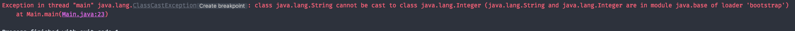
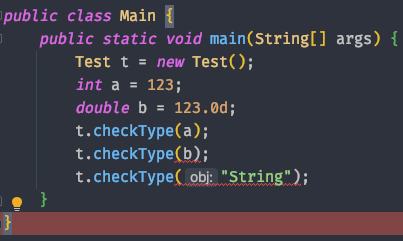
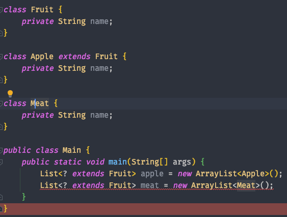
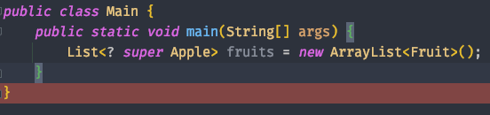

# week 14. 제네릭 

### 14-1. 제네릭 사용법

제네렉이란 무엇일까? 

자바의 제네릭이란 data type 일반화(generalize) 하는 의미로 사용이 되는데, **메소드나 클래스 내부에서 사용되는 데이터 타입을 컴파일 타임에 외부에서 지정하는 것**을 뜻한다.

만약 제네릭을 사용하지 않는다면 어떻게 될까?

자바에서 제네릭을 지원하지 않을때는 Object 타입으로 클래스를 생성하여 타입을 강제 변환시켜 사용을 하였었다. 하지만 이는 프로그램의 성능 저하로 이어 질 뿐만 아니라 타입 변환 시 자칫 잘못하면 에러를 내는 결과도 내곤 했다.

```
class Test {
    private Object obj;

    public void setObj(Object obj) {
        this.obj = obj;
    }

    public Object getObj() {
        return this.obj;
    }
}

public class Main {
    public static void main(String[] args) {
        Test t = new Test();
        Integer data = 1;
        t.setObj(data);
        Integer check = (Integer) t.getObj();
        System.out.println(check);
    }
}
```

제네릭을 사용하지 않은 예제이다. 보면 Integer check를 생성 할 때 Object 형 타입을 Integer로 캐스팅을 하는 것을 볼 수 있다.

그렇다면 이 코드는 왜 문제가 되는 것일까?

코드를 조금 수정하여 Test t가 String type을 받을 수 있도록 해보자.

```
public class Main {
    public static void main(String[] args) {
        Test t = new Test();
        t.setObj("1");
        Integer int1 = (Integer) t.getObj();
        Integer int2 = (Integer) t.getObj();

        System.out.println(int1 + int2);
    }
}
```

String type 데이터를 set해주었고 Test 클래스에서는 Object type의 데이터를 받게 되었으니 문제가 되지 않는다.

하지만 데이터를 가져온 뒤 더하기 연산을 한 결과를 출력하려고 하면 런타임에 에러가 나게 된다.



캐스팅에 대한 에러이다. 이처럼 Object type의 데이터를 형 변환 하면서 예측하지 못한 에러를 만날 수 있다.

하지만 제네릭을 사용하여 타입 변환을 강제하지 않고 컴파일 시에 타입을 정하게 되어 실행 시 에러가 나는 것을 방지 할 수 있다.

```
class Test <T> {
    private T obj;

    public void setObj(T obj) {
        this.obj = obj;
    }

    public T getObj() {
        return this.obj;
    }
}

public class Main {
    public static void main(String[] args) {
        Test<Integer> t = new Test<>();
        t.setObj("1");
        Integer int1 = (Integer) t.getObj();
        Integer int2 = (Integer) t.getObj();
        System.out.println(int1 + int2);
    }
}
```


이처럼 t.setObj("1")에서 컴파일 에러를 만날 수 있다.

아래는 제네릭을 사용한 아주 간단한 예제이다. 제네릭 타입의 클래스를 선언하고 값을 출력 한뒤 type 까지 출력한다.

제네릭을 사용하는 예제중 가장 익숙한 코드 하나를 보자.

```
List list = new ArrayList(); //제네릭을 사용하지 않은 예제
List<Integer> list = new ArrayList<>(); //제네릭을 사용한 예제
```

우리가 매번 생성했던 ArrayList의 <> 가 바로 제네릭인 것이다. 제네릭을 사용하지 않은 예제에서도 컴파일 에러가 발생하지 않는다.  
하지만 타입을 명시해줌으로써 우리는 제네릭의 장점을 취할 수 있는 것이다.

또한 List list와 같이 <> 제네릭을 사용하지 않는 타입을 **raw type**라고 한다.

```
class Test <T> {
    private T obj;

    public void setObj(T obj) {
        this.obj = obj;
    }

    public T getObj() {
        return this.obj;
    }
}

public class Main {
    public static void main(String[] args) {
        Test<Integer> t = new Test<>();
        t.setObj(1);
        System.out.println(t.getObj());
        System.out.println(t.getClass().getTypeName());
    }
}
```

제네릭을 사용하여 t라는 객체를 컴파일 타임에 인스턴스 사용시 타입을 정하게 된다.


obj의 값으로 넣어준 1과 Test라는 obj의 타입을 출력하였다.  

다음은 제네릭에서 멀티 타입 파라미터를 이용한 것이다. 예제를 보도록 하자.

```
class Test <A, B, C> {
    private A a;
    private B b;
    private C c;

    public A getA() {
        return a;
    }

    public void setA(A a) {
        this.a = a;
    }

    public B getB() {
        return b;
    }

    public void setB(B b) {
        this.b = b;
    }

    public C getC() {
        return c;
    }

    public void setC(C c) {
        this.c = c;
    }

    public void printType() {
        System.out.println(a.getClass().getTypeName());
        System.out.println(b.getClass().getTypeName());
        System.out.println(c.getClass().getTypeName());
    }
}

public class Main {
    public static void main(String[] args) {
        Test<Integer, Double, String> t = new Test<>();
        Integer a = 1;
        Double b = 1.0d;
        String c = "one";

        t.setA(a);
        t.setB(b);
        t.setC(c);

        System.out.println(t.getA());
        System.out.println(t.getB());
        System.out.println(t.getC());

        t.printType();
    }
}
```


type를 보면 Integer, Double, String 이 출력 되는 것을 볼 수 있다.

### 14-2. 제네릭 주요 개념 (바운디드 타입, 와일드 카드)

바운디드 타입에서 **바운디드란 타입**을 제한한다는 의미이다.

다음 예제를 보도록 하자.

```
public <T extends Integer> void checkType(T obj) {
        if (obj.getClass().getTypeName().equals("java.lang.Integer")) {
            System.out.println("Integer");
        }
    }
```

<T extends Integer>를 명시하여 제네릭을 Integer로 바운디드 하였다. 즉 Integer로 제한을 한다는 것이다. 메소드를 호출 해 보도록 하자.



int로 선언한 변수 a는 매개변수로 넣어 줄 수 있지만 double 타입과 String 타입은 컴파일 에러가 나게 된다.

이처럼 바운디드 타입을 사용하여 제네릭을 사용하면 개발자가 의도하지 않은 타입의 경우에는 제네릭을 사용하지 않도록 할 수 있다.

그렇다면 와일드 카드란 무엇일까?

와일드 카드란 제네릭에서 타입에 제한이 없도록 하는 것인데, 다음과 같은 방식으로 사용이 된다.

```
<? extends T> T와 T의 자손들만 사용 가능  
<? super T>  T와 T의 조상들만 사용 가능
<?> 제한 없음
```

보통 많이 사용되는 과일로 예를들어 제네릭과 와일드카드를 예제를 보도록 하자.



과일 클래스와 사과 클래스, 그리고 고기 클래스가 있다.

ArrayList로 생성되는 리스트중 제네릭을 사용하여 과일의 자손들만 사용 가능한 리스트를 생성하였고 Meat 클래스를 사용한 리스트도 생성하려 했지만 이처럼 컴파일 에러를 만나게 된다.

그렇다면 super를 사용해 보도록 하자.



제네릭에는 Apple의 조상 클래스가 올 수 있도록 제한 하였고 Fruit 타입의 리스트를 생성하도록 한 예제이다. 


### 14-3. 제네릭 메소드 만들기

다음은 제네릭 메소드를 사용해 보자. 제네릭 메소드란 제네릭으로 타입이 선언 된 메소드이다.
 
제네릭 메소드를 사용하여 타입을 간단하게 체크하고 출력 해 주는 예제이다.

```
class Test {
    public <T> void checkType(T obj) {
        if (obj.getClass().getTypeName().equals("java.lang.String")) {
            System.out.println("String");
        }

        if (obj.getClass().getTypeName().equals("java.lang.Integer")) {
            System.out.println("Integer");
        }
    }
}

public class Main {
    public static void main(String[] args) {
        Test t = new Test();
        t.checkType("String");
        t.checkType(123);
    }
}
```

제네릭 메소드를 사용하여 매개변수를 받았고 간단하게 결과를 출력한다.


### 14-3. Erasure

자바에서는 제네릭 클래스의 객체를 생성 할 때 타입을 지워버린다. 타입은 컴파일 타임 때 까지 존재하고 이후 바이트 코트로 변환 될 때는 해당 타입이 제거가 된다.
이를 type Erasure라고 한다.

만약 제네릭 클래스를 사용할때 따로 bound 되지 않았다면 type erasure에 의해 T -> Object로 변환되어 바이트 코드를 생성하게 된다.

만약 <T extends Test>로 타입을 바운드 하였다면 바이트 코드에서는 Test로 치환이 된다.

