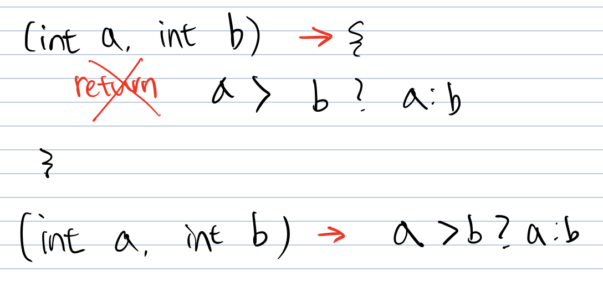
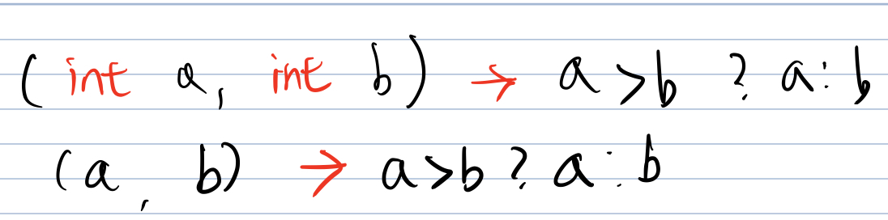
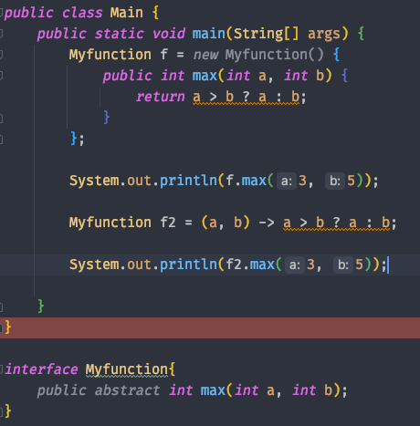
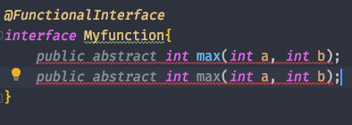

# week 15. 람다식

### 15-1. 람다식 사용법

람다식은 java 1.8 부터 등장하였고 자바에 많은 변화를 일으켰다고 생각한다.

람다의 등장 이후 코드는 많이 간결해 졌으며, 함수형 프로그래밍 또한 가능하게 되었다. 람다를 사용하면 클래스를 생성하거나 객체를 생성하는 등의 코드를 생성하지 않고도 함수를 실행 할 수 있으며 람다식을 통해 매개변수로 메소드를 넣는 등의 방법까지 가능하게 되었다.

람다를 통해 간결성, 유연성을 높이는 코드를 작성 할 수 있어 많은 사람들이 자바8의 큰 변화로 람다를 꼽기도 한다.

그렇다면 람다는 어떻게 사용 할 수 있을까?

아주 간단한 예제를 보도록 하자.

```
int max(int a, int b) {
    return a > b ? a : b;
}
```

위의 예제는 a와 b중 큰 값을 리턴해주는 메소드이다. 그렇다면 이 식을 람다로 표현하면 어떻게 될까?

> (a, b) -> a > b ? a : b;

이 람다식은 익명함수라고 하며 반환 타입과 메소드의 이름을 지워 표현하게 된다.

> 메소드와 함수의 차이점은?
> * 메소드는 클래스에 종속적
> * 함수는 클래스에 독립적
> * 자바에서 메소드는 클래스 내부에서 선언되기에 모두 메소드 이다.

람다식을 작성할 때는 몇 가지 규칙을 따르면 되는데 그 규칙을 한번 알아보자.

1. 메서드의 이름과 return 타입을 제거하고 '->'를 {} 블록 앞에 붙인다.  
     
2. 반환값이 있는 경우, 식이나 값만 적고 return문 생략 가능   
   
3. 매개변수의 타입이 추론이 가능하면 생략가능
   

결국 위의 식은

```
(a, b) -> a > b ? a : b
```
가 된다.


자바에서는 메소드가 따로 존재 할 수 없기 때문에 람다식은 **익명 함수가 아니라 익명 객체**이다.

즉 우리가 보았던 이 식은

>(a, b) -> a > b ? a : b

```
new Object() {
   int max(int a, int b) {
       return a > b ? a : b;
   }
}
```

이다. 이는 익명 클래스, 익명 객체이며 객체의 선언과 생성을 동시에 하는 것이다.

하지만 익명 객체의 경우에는 이를 사용하기 위해 참조 변수가 필요한데, 위와 같이 new Object()로 생성하게 된다면 에러가 나게 된다.  

왜냐하면 Object 클래스에서는 max라는 메소드가 없기 때문이다. 우린 이 에러를 해결하기 위해 함수형 인터페이스를 사용하게 된다.



위의 식에서 보듯이 함수형 인터페이스를 선언하고 람다식을 이용해 f2를 선언하였다.

f도 틀린 문법이 아니지만 람다식을 확인하기 위해 f2를 예시로 보였다.


### 15-2. 함수형 인터페이스

함수형 인터페이스란 과연 어떤것일까?

함수형 인터페이스는 인터페이스에 추상 메소드가 1개인 인터페이스를 의미한다.

만약 메소드가 2개라면 함수형 인터페이스가 아니게 된다. 애노테이션을 이용하여 한번 확인 해 보도록 하자.

인터페이스는 위에서 선언한 MyFunction을 사용 하기로 한다.



@FunctionalInterface 애노테이션은 함수형 인터페이스라고 알려주는 역할이며 만약 함수형 인터페이스의 규격에 어긋난다면 컴파일러가 에러임을 알려주게 된다.

위의 예시에서도 추상 메서드를 2개로 선언한 순간 에러임을 표기해준다.

그렇다면 함수형 인터페이스는 왜 만들어졌을까? 

함수형 인터페이스를 통해 우리는 함수를 1급 시민으로 처리가 가능하며 이는 함수를 하나의 값으로 취급하여 함수형 프로그래밍의 패러다임에 접근하는 것이라고 생각한다.

때문에 이는 java로 함수형 프로그래밍이 가능하다는 것이 가장 큰 특징이 아닐까?

그렇다면 함수형 프로그래밍을 간단히 살펴보도록 하자.

> 함수형 프로그래밍의 컨셉   
>* 불변성(Immutability)  
>* 일급 시민(First class)
>* 고차 함수(Higher-order Functions)
>* 지연연산(Lazy evaluation)   

불변 상태로 만든다는 것은 입력값이 동일하면 출력값 또한 마찬가지로 같아야 한다는 의미이며, 이는 수학적 함수를 떠올리면 된다. 즉 순수함수를 통하여 부수적인 오류를 제거하는 것이다.

또한 일급 시민으로써의 함수는 인자로 전달이 가능해야 하며, 리턴으로 함수를 리턴 가능해야하고 변수에 함수를 할당 할 수 있어야 한다.

위의 예제에서 보듯이 Myfunction f을 통해 변수에 함수를 넣었었는데, 이 또한 함수형 인터페이스를 사용 함으로써 가능한 부분이다.

고차함수란 함수에 함수를 전달하여 만든 새로운 함수를 뜻하며 이를 통해 프로그램을 더욱 간결하게 작성이 가능하다. 

지연 연산이란 어떤 값이 실제로 쓰이기 전까지는 연산을 하지 않고 필요할 때 연산을 하는 방식이다. java를 통해 위에서 언급한 패러다임을들 적용 할 수 있을까?


> 참고
> * 남궁성님의 자바의 정석 유튜브 (https://www.youtube.com/watch?v=3wnmgM4qK30&t=942s&ab_channel=%EB%82%A8%EA%B6%81%EC%84%B1%EC%9D%98%EC%A0%95%EC%84%9D%EC%BD%94%EB%94%A9)