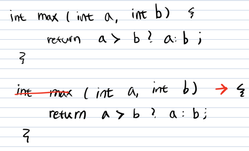

# week 15. 람다식

### 15-1. 람다식 사용법

람다식은 java 1.8 부터 등장하였고 자바에 많은 변화를 일으켰다고 생각한다.

람다의 등장 이후 코드는 많이 간결해 졌으며, 함수형 프로그래밍 또한 가능하게 되었다. 람다를 사용하면 클래스를 생성하거나 객체를 생성하는 등의 코드를 생성하지 않고도 함수를 실행 할 수 있으며 람다식을 통해 매개변수로 메소드를 넣는 등의 방법까지 가능하게 되었다.

람다를 통해 간결성, 유연성을 높이는 코드를 작성 할 수 있어 많은 사람들이 자바8의 큰 변화로 람다를 꼽기도 한다.

그렇다면 람다는 어떻게 사용 할 수 있을까?

아주 간단한 예제를 보도록 하자.

```
int max(int a, int b) {
    return a > b ? a : b;
}
```

위의 예제는 a와 b중 큰 값을 리턴해주는 메소드이다. 그렇다면 이 식을 람다로 표현하면 어떻게 될까?

> (a, b) -> a > b ? a : b;

이 람다식은 익명함수라고 하며 반환 타입과 메소드의 이름을 지워 표현하게 된다.

> 메소드와 함수의 차이점은?
> * 메소드는 클래스에 종속적
> * 함수는 클래스에 독립적
> * 자바에서 메소드는 클래스 내부에서 선언되기에 모두 메소드 이다.

람다식을 작성할 때는 몇 가지 규칙을 따르면 되는데 그 규칙을 한번 알아보자.

1. 메서드의 이름과 return 타입을 제거하고 '->'를 {} 블록 앞에 붙인다.  
     
2. 반환값이 있는 경우, 식이나 값만 적고 return문 생략 가능   


> 참고
> * 남궁성님의 자바의 정석 유튜브 (https://www.youtube.com/watch?v=3wnmgM4qK30&t=942s&ab_channel=%EB%82%A8%EA%B6%81%EC%84%B1%EC%9D%98%EC%A0%95%EC%84%9D%EC%BD%94%EB%94%A9)