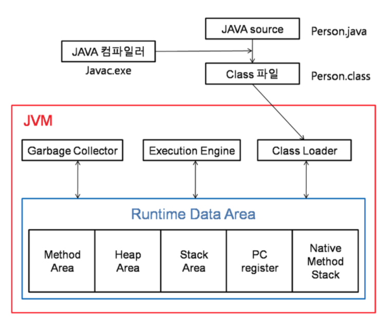
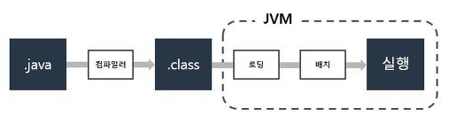

# 01. JVM은 무엇이며 자바 코드는 어떻게 실행하는 것인가.

### 1-1. JVM이란?
자바는 JVM이라는 가상 머신에서 동작하게 된다.
JVM이란 Java Virtual Machine의 약자로 자바 기반의 애플리케이션을 위한 실행 환경을 제공한다.
 
JVM에는 2가지 기본 기능이 있는데, 자바 프로그램이 어느 기기 또는 어느 운영체제에서도 실행 되게 하는 것과
메모리를 관리하고 최적화 하는 것이다.

때문에 JVM은 Java가 OS에 구애 받지 않고 동작 하도록 해주며 가비지 컬렉션을 수행하게 된다.


### 1-2. JVM의 구조
JVM은 Class Loader, Garbage Collector, Execution Engine 3가지로 나뉜다.


#### [Class Loader]
Class Loders는 런타임에 Java 클래스를 JVM에 동적으로 로드하느 역할을 담당한다.
따라서 JVM은 클래스 로더 덕분에 Java 프로그램을 실행하기 위한 기본 파일이나 파일 시스템을 알 필요가 없다.
Java 클래스는 한 번에 모두 메모리에 로드 되는것이 아닌 애플리케이션에 의해 필요할 때 로딩된다. 또한 클래스가 로딩이 될 때 이미 로딩이 되어있다면 메모리에 캐싱이 되어 있기 때문에 클래스를 반환하게 된다.
만약 로딩이 되어있지 않다면 parent에게 클래스를 로딩하게 위임을 하게 parent가 로딩을 할 수 없다면 자기 자신이 로딩하게 된다. 
또한 계층적 구조를 가지도록 생성이 가능하다. Bootstrap <- Extension <- Application

Bootstrap Class Loader: JVM이 실행될 때 실행 되는 Class Loader로서 $JAVA_HOME/jre/lib에 있는 JVM을 실행할 때
가장 기본이 되는 라이브러리들을 로그 하는 Class Loader이다. Bootstrap Class Loader는 자바가 아닌 네이티브로 구현되어있다.

Extension Class Loader: 추가로 로딩되는 클래스들로 $JAVA_HOME/lib/ext/*.jar에 있는 클래스들을 로드한다.

System Class Loader: ClassPath에 정의 되거나 JVM옵션으로 -cp, -classpath가 설정된 클래스들을 로드

#### [Garbage Collector]
C나 C++에서는 OS 레벨의 메모리를 직접 free 해주기 때문에 메모리를 명시적으로 해제해준다.
Java의 경우 JVM을 통하여 간접적으로 메모리에 접근 하게 되는데 메모리 관리를 이 JVM에게 맡겨 버리게 된다.

```
String s = "abc";
```
라는 코드를 작성해보자. 이 구문이 실행이 되면 힙에 s라는 변수가 들어가게 된다.
```
s += "def";
```
라는 코드를 추가하여 보자. 이 결과는 힙에 새로운 String이 들어가게 된다(기존것에 추가가 되는것이 아님)
그러면 기존의 "abc" 문자열을 레퍼런스 하고 있는 변수가 없으므로 이는 Unreachable 오브젝트가 된다.

그리고 JVM에서 Garbage Collection이 일어나게 된다.
또한 JVM에서 메모리가 부족해지는 순간이 오면 OS에게 메모리를 더 요청하게 되는데 이때 Garbage Colltector가 실행된다.

#### [Execution Engine]
로드된 클래의 ByteCode를 실행하는 Runtime Module
Class Loader를 통해 런타임 데이터 영역에 배치된 바이트 코드들을 명령어 단위로 읽는다.

이 때 Execution Engine은 바이트 코드를 기계가 실행할 수 있는 형태로 변경한다.

인터프리터: 바이트 코드 명령어를 하나씩 읽어서 해석하고 실행.
하나하나의 해석은 빠르고 전체적인 실행 속도는 느리다. JVM안에서 바이트코드는 기본적으로 인터프리터 방식으로 동작

JIT 컴파일러: 인터프리터의 단점을 보완하기 위해 도입된 방식
바이트 코드 전체를 컴파일하여 네이티브 코드로 변경하고 이후에는 해당 메서드를 네이티브 코드로 직접 실행한다.
바이트 코드 전체가 컴파일된 네이티브 코드로 실행하게 되어 전체적인 실행 속도가 빠르다.
네이티브 코드는 캐시에 보관하기 때문에 한 번 컴파일 된 후 바로 꺼내어 실행되어 빠르게 실행된다.

하지만 JIT 컴파일러가 컴파일 하는 과정은 바이트 코드를 하나씩 인터프리팅 하는 것보다 오래 걸리기 때문에 JVM 내부적으로 해당 메서드가 얼마나 자주 호출 되는지 체크하고 일정 기준을 넘었을 때만 JIT 컴파일러를 통해 네이티브 코드를 생성한다.

### 1-3. 자바가 실행되는 과정



Java언어를 Java 컴파일러가 가상 기계어 파일인 Java 클래스로 만든다.
즉 이때 .java가 .class인 바이트코드로 바뀌게 되고 JVM의 Class Loader를 통해 class파일들을 로딩하게 된다.

앞서 언급한 JVM의 구조에서 클래스로더 3계층 하층에 애플리케이션 딴의 클래스들을 로딩하는 Class Loader 존재한다(User-Defined Class Loader).

Class Loader는 실행에 필요한 클래스 파일들을 동적으로 메모리에 올리게 되며 바이트 코드에 문제가 없는지 ByteCode Verifier를 통해 검증하게 된다.
그리고 JVM이 바이트코드를 해석하며 읽는 방식이 바로 위에 언급한 Excution Engine의 두 가지 방법이다.

### 1-4. 컴파일 하는 방법, 실행하는 방법
javac 명령어를 이용하여 .java 파일을 인자로 넣어 컴파일 해주면 된다.
java 명령어를 이용하여 .class 파일을 인자로 넣어 실행하면 된다.

나의 경우는 보통 .jar 파일을 실행가능한 jar 파일로 묶어 실행하였었다. 

### 1-5. JRE, JDK의 차이

JRE: Java Runtime Environment의 약자로 자바 프로그램을 실행시켜주는 환경을 구성해주는 도구
JRE는 JVM의 실행환경을 구현했다고 할 수 있다. 자바 애플리케이션을 실행하기 위한 최소의 실행 환경 제공.

JDK: Java Development Kit의 약자.
JDK는 JRE에 속해 있다고 볼 수 있으며 javac, java 등을 제공한다.
컴파일러를 포함하고 있다.
 